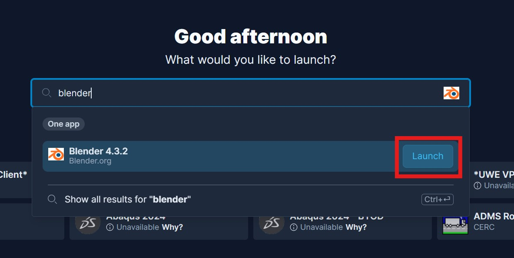
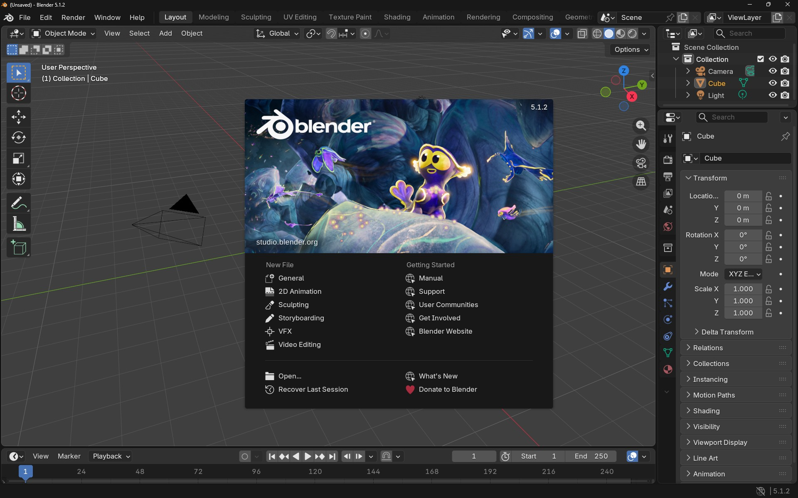
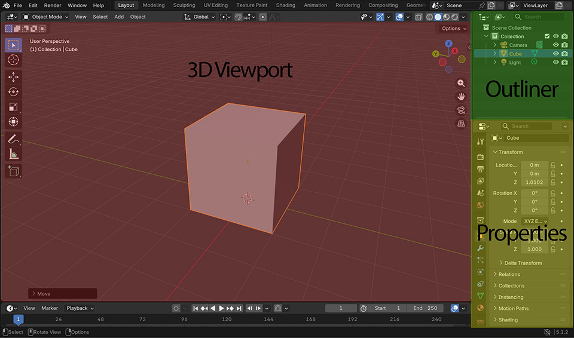
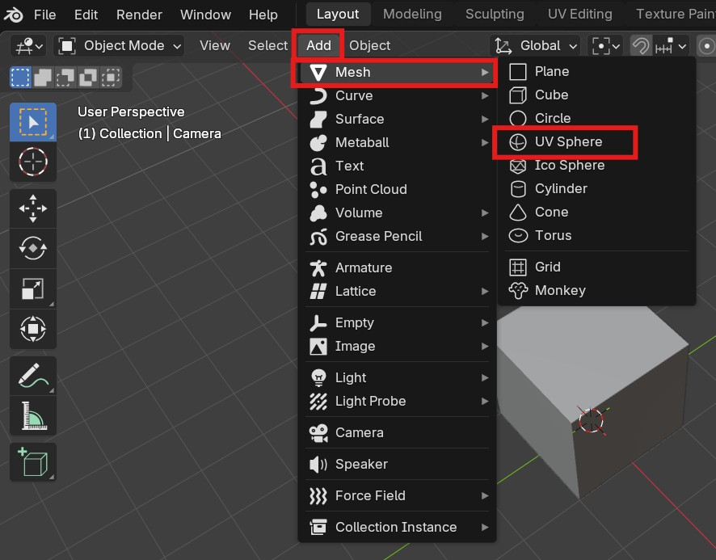
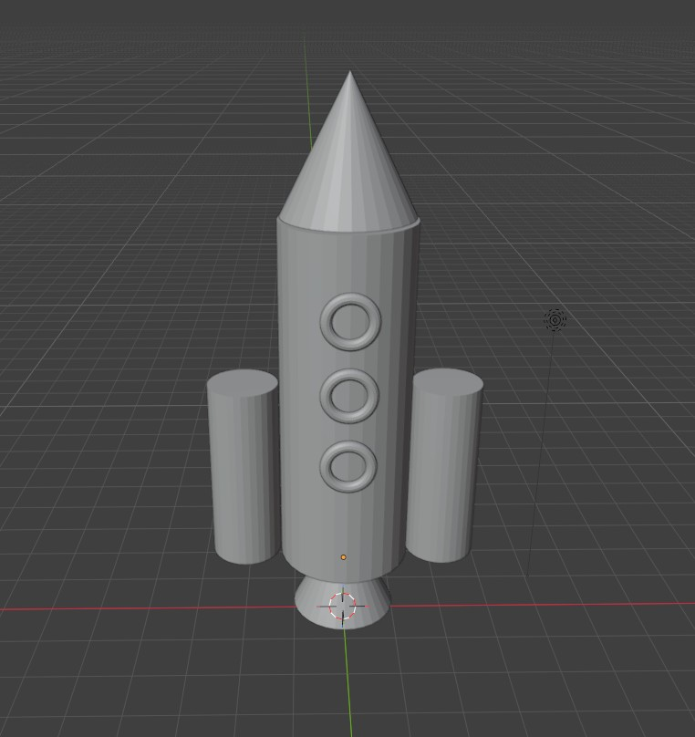
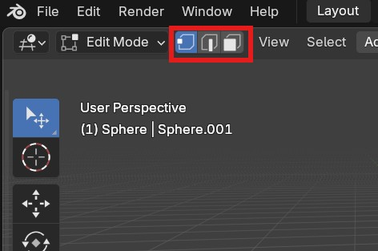

# Worksheet 1

## Introduction

My name is Tom Garne and I will walk you through 

------ Video 0 - intro?

## Install

### On Your machine
On you own machine, you can download and install Blender for free for Mac, PC and Linux from here:

[https://www.blender.org/download/](https://www.blender.org/download/)

We will be using version 5.1, but as long as its version 5 you will be able to follow along with these worksheets.

### On Campus

You can find Blender on UWE's software launcher "Apps Anywere"

To open [https://appsanywhere.uwe.ac.uk](https://appsanywhere.uwe.ac.uk)]

Search for **Blender** and press launch

## Mouse

We strongly recommend you get a mouse for 3D work.

You can buy one from the project room (2q20)

You can use a trackpad but you will find it slower and more frustrating.

## 1. Interface

Most 3D software shares common elements called **Areas** in Blender, they can be in different locations and can be rearranged by the user

- **3D viewport** - Your 3D scene
- **Outliner** -  A list of all the object in your scene (Meshes, lights, cameras etc..)
- **Properties** - view and modify information about the selected object and the whole scene

-------video 1 quick Video tour

- tour
	+ 
	1. 3d viewport
		1. - z is up
	2. outliner
		camera, cube, light, collection
	3. properties
		1. render
		2. object
		3. modifiers
		4. materials
	4. workspaces
	5. move and resize and delete 

## 2. Navigation

In the 3D Viewport you can move your editor camera:

Rotate - Hold middle mouse button
Pan - Shift + Hold middle mouse button
zoom - mouse wheel

------- video 2 navigation
- basic navigation
- laptop options.

## 3. move scale rotate

When you have an object selected in the viewport you can move, rotate and scale it. The hot keys are:

**g** - move
**r** - rotate
**s** - scale

--- video 3 move, scale, rotate

- select object
- press buttons
- use hot keys
- axis lock.
- shift

## 4. create and arrange primitives

Cubes, Cylinders and Spheres are all primative shapes, you can create them from the top menu:

Add > Mesh

---- video 4 - add mesh

- add mesh with button
- add with shortcut
- move them around
- know sizzes

video 4.5 - saving.

------SAVE

## 5. Challenge 1 - make a Rocket 

Just using primitive meshes, make a simple rocket

## 6. Collections and naming

As you add objects to your scene it is important to keep things organised, you can do this by renaming the meshes, and creating collections

----------video 6 - collections

## 7. vertexes, faces and edges

Primative meshes are made up of vertexes, edges and faces.

In Blender, you can switch between **Object** mode and **edit** mode using the **tab** key

In edit mode you can select and move the vertexes, faces and edges

You can also select these using the number row

1 - Vertex
2 - Edge
3 - Face

poly count

With these selected you can move, scale and rotate them the same way as whole objects.

---- video 5 show vertext selection

-- edit mode
- select vertex,face,edge with buttons and hotkeys
- move, scale rotat3
- select multiple ones - double click

WARNING - Dont add new mesh primatives when in edit mode.

## 7. Materials

We can add material to whole objects, or individual faces.

In this video I will show you how to add simple colours to your objects and faces

--- video 6 - add colours to shapes

- object mode
- add new material and rename
- change colour
- edit mode
- select face, add new material slot and material
- change colour.

reminder - make sure you are in the correct shading mode

In future worksheets we will delve deeper into adding images and texture painting.

## 8. Challenge - make a simple character.

Using the skills you have learnt in this worksheet create a simple vehicle. Add a body, wheels and whatever else you would like.

## 9. Challenge solution

--- video 7, challenge solution

## Extra resources

[Blender 5.1 Manual](https://docs.blender.org/manual/en/latest/index.html)

[Blender Cheat Sheet](https://raw.githubusercontent.com/nachazo/blender-cheat-sheet/main/blender-cheat-sheet.png)

[YouTube short course](https://www.youtube.com/watch?v=kVcY7K-JA1Y&list=PLn3ukorJv4vv9_e-htADGsPX9TMaQpHV8)

