# Worksheet 1

## Introduction

These worksheets will walk you through the basics to get you started modelling in Blender.

They are  combination of text and videos, if you get stuck please ask for help. We all love making 3D content and are happy to share our knowledge.

You can also ask your neighbour for help, they may have faced the same issue as you.

Learning new software takes practice so please do the challenges in these worksheets to improve your skills.

## Install Blender

### On Your machine
You can download and install Blender for free for Mac, PC and Linux from here:

[https://www.blender.org/download/](https://www.blender.org/download/)

We will be using version 5.1, but as long as its version 5 you will be able to follow along with these worksheets.

### On Campus (2q24, 2q25)

You can find Blender on UWE's software launcher "Apps Anywere"

* Open [https://appsanywhere.uwe.ac.uk](https://appsanywhere.uwe.ac.uk)

* Search for **Blender** and press **launch**

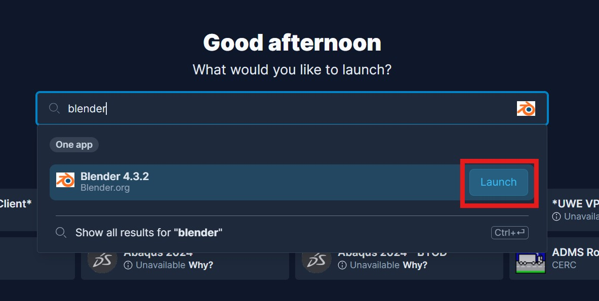

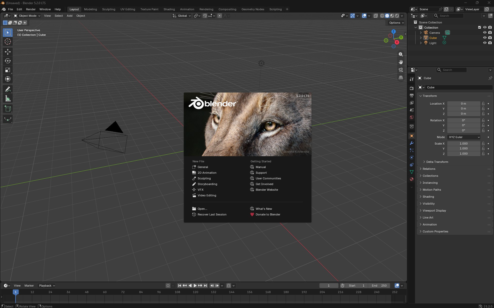

## Mouse

We strongly recommend you get a mouse for 3D work.

You can buy one from the project room (2q20), I will bring some spares to class if you need one.

You **can** use a laptop trackpad but you will find it slower and more frustrating.

## 1. Interface

Al 3D software packages shares common elements, they can be in different locations and can be rearranged by the user.

- **3D viewport** - Your 3D scene
- **Outliner** -  A list of all the object in your scene (Meshes, lights, cameras etc..)
- **Properties** - View and modify information about the selected object and the whole scene

### Saving

Remember to save you work often, it can be very frustrating to loose work in a crash.

- Save this new project by going to **file > save as**

This video walks you through the interface in more details:
[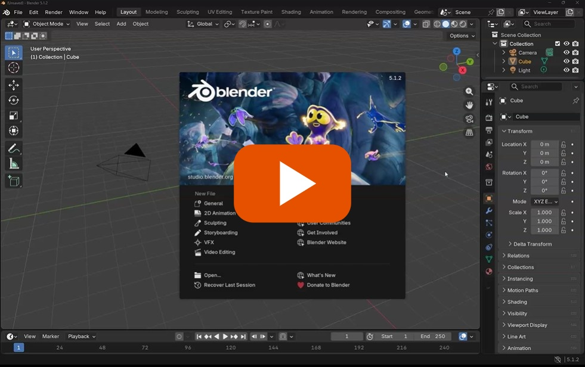](https://uwe.cloud.panopto.eu/Panopto/Pages/Viewer.aspx?id=80a2040a-d8e3-45c3-a3e8-b474009ba73d)

## 2. Navigation

In the 3D viewport you can move your editor camera:

* **Rotate** - Hold middle mouse button
* **Pan** - Shift + Hold middle mouse button
* **zoom** - Mouse wheel

- Practice navigating around the scene.

This video shows you how to use the above commands, and also how to emulate these if you don't have a mouse:

[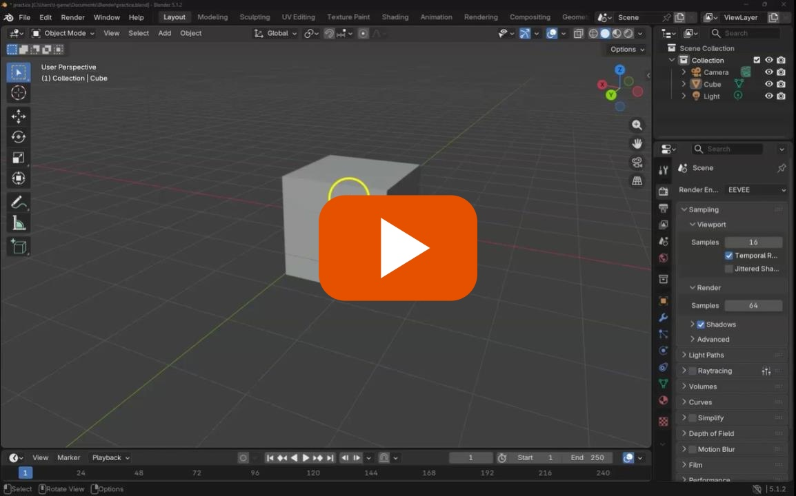](https://uwe.cloud.panopto.eu/Panopto/Pages/Viewer.aspx?id=eeedacf2-7294-4f4f-9f07-b47400a1cde4)

## 3. Move scale rotate

When you have an object selected in the viewport you can move, rotate and scale it. The hot keys are:

* **g** - move
* **r** - rotate
* **s** - scale

or you can use the button at the left of the screen

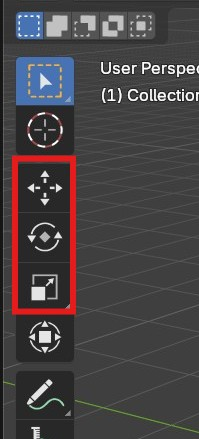

- Select the cube and try to move, rotate and scale it.

This video shows you how to use these tools:

[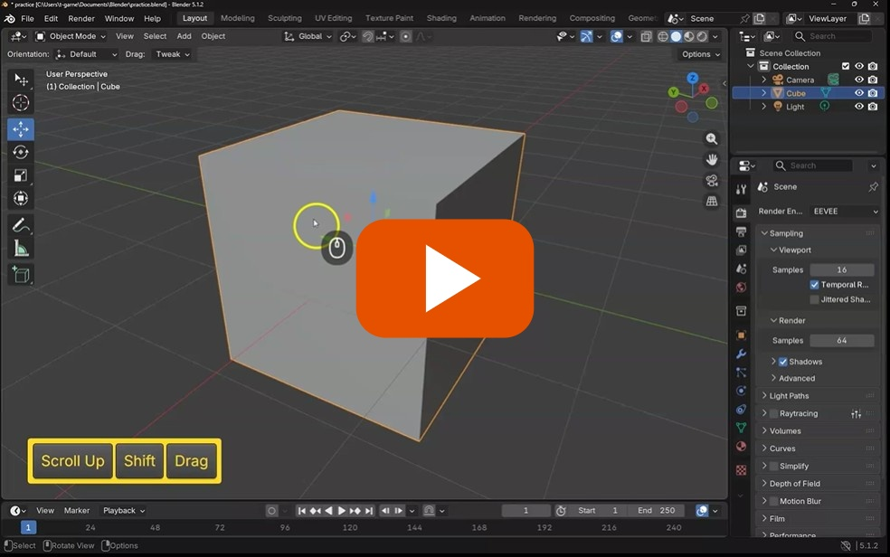](https://uwe.cloud.panopto.eu/Panopto/Pages/Viewer.aspx?id=445a3070-a1d8-415c-9d01-b47400aa60ca)

Tips:
- Move using the arrows
- Shift will move, rotate and scale more slowly

## 4. Create and arrange primitives

Cubes, Cylinders and Spheres are all primitive shapes, you can create them from the top menu:

Add > Mesh

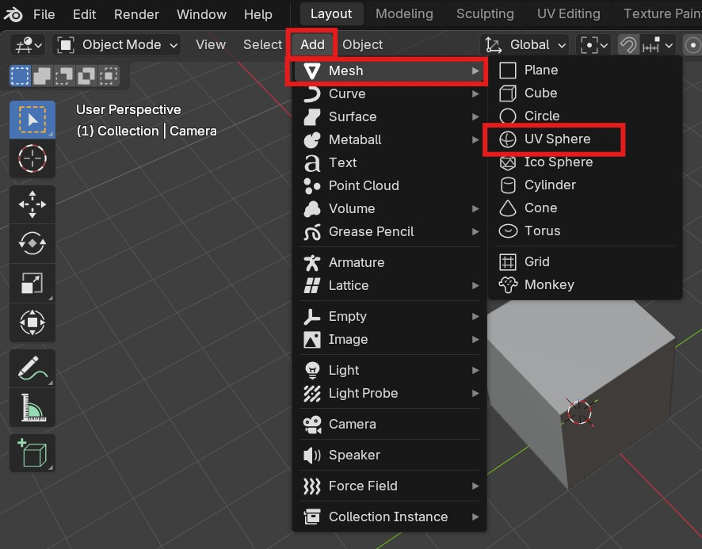

As soon as you have made a new shape an option box appears at the **bottom left** of the screen, this gives you the opportunity to change the properties of the object.

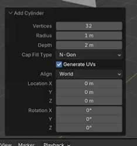

- Make some new primitive shapes and move them around your scene.

This video show you how to make primitives and change their properties:
[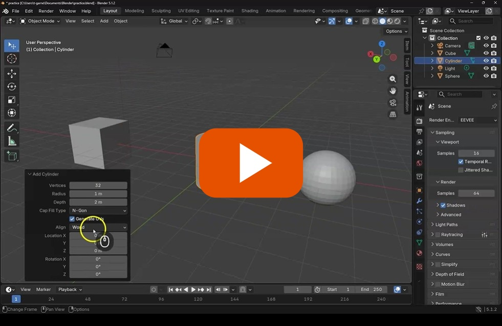](https://uwe.cloud.panopto.eu/Panopto/Pages/Viewer.aspx?id=158b53eb-c292-485d-a469-b47400b092a6)

Make sure you have saved your project.

## 5. Challenge - Make a Rocket 

Just using primitive meshes, make a simple rocket.

Here is mine, yours can look different but try to use a range of primitive meshes.

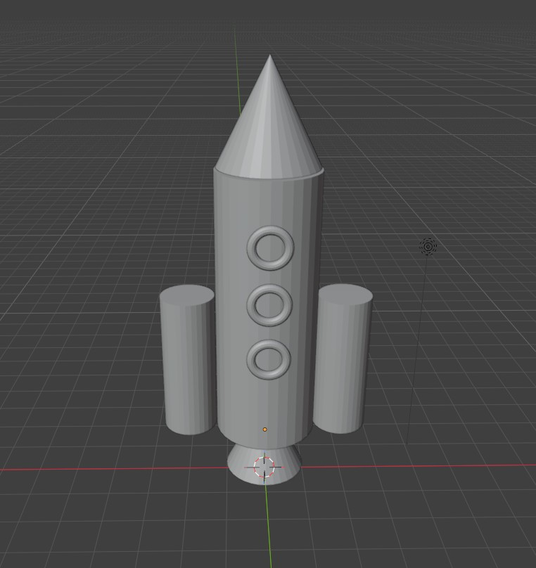

Try to do this yourself before looking at my solution video bellow:

[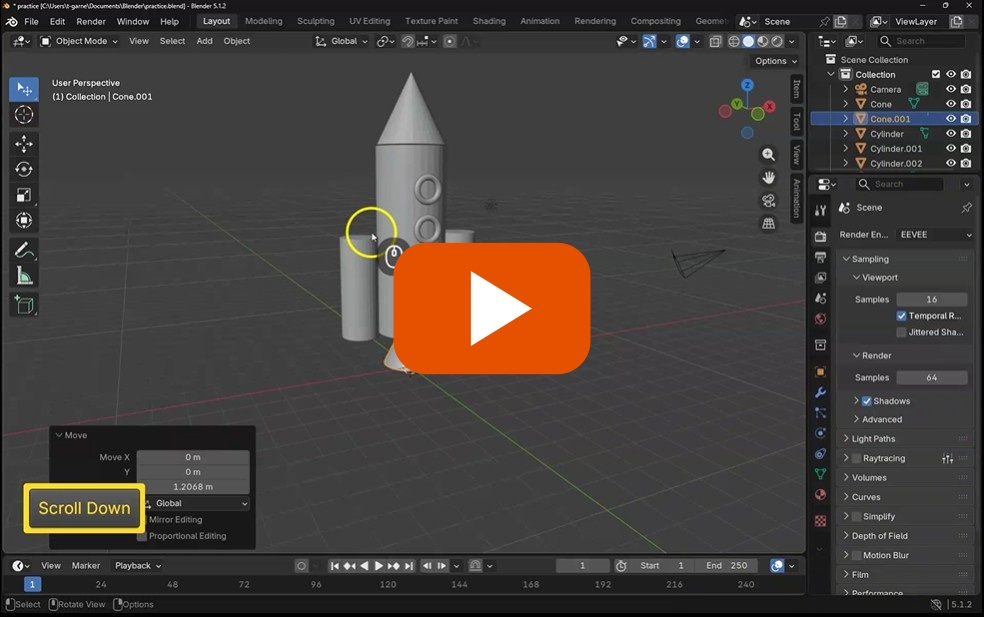](https://uwe.cloud.panopto.eu/Panopto/Pages/Viewer.aspx?id=322889eb-eb28-4fdc-8c5c-b47400b315fe)

## 6. Collections and naming

As you add objects to your scene it is important to keep things organised, you can do this by renaming the meshes, and creating collections.

You can rename objects in the outliner by double clicking on them

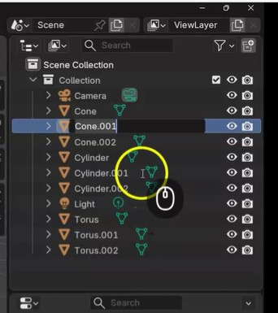

You can create new collections to group your objects

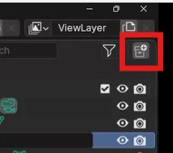

Click and drag objects to add them to move them between collections.

- Rename the elements of your rocket, and group them together in a collection.

For a video walkthough of this, watch this video:

[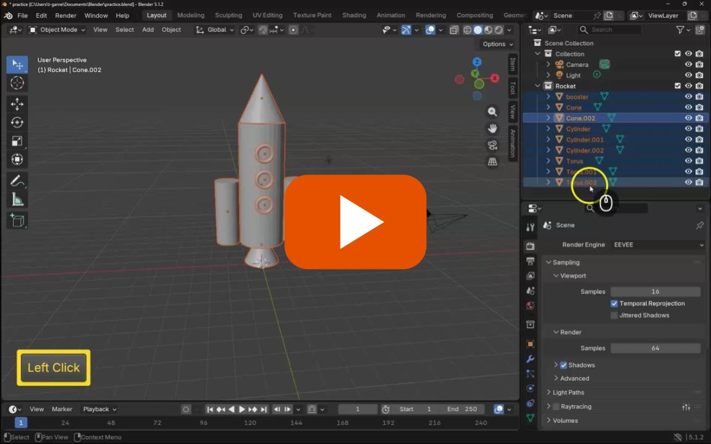](https://uwe.cloud.panopto.eu/Panopto/Pages/Viewer.aspx?id=3ce44ef4-0611-43a7-b61c-b47400b73462)

## 7. Vertexes, faces and edges

Primitive meshes are made up of multiple components - vertexes (points), edges (lines) and faces (polygons).

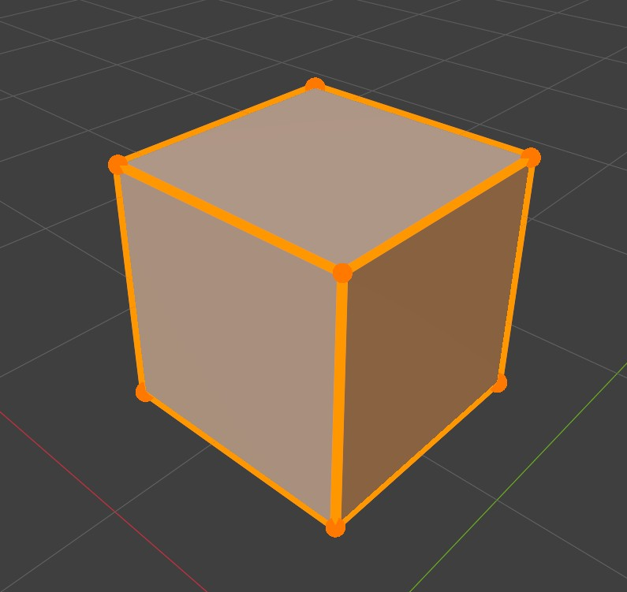

So far we have been in **Object** mode, which allows us to select whole shapes.

To select the components we need to switch to **edit**mode.

In Blender, you can switch between **Object** mode and **edit** mode using the **tab** key

In edit mode you can select and move the vertexes, faces and edges by selecting them in the top menu:

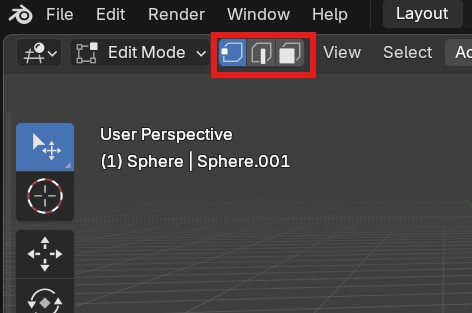

You can also select these using the number row on you keyboard

* **1** - Vertex
* **2** - Edge
* **3** - Face

With these selected you can move, scale and rotate them the same way as whole objects.

- Select one of your objects and press **tab** to enter **edit** mode.
- practice moving individual edges, faces and vertexes

This video show this in more detail:
[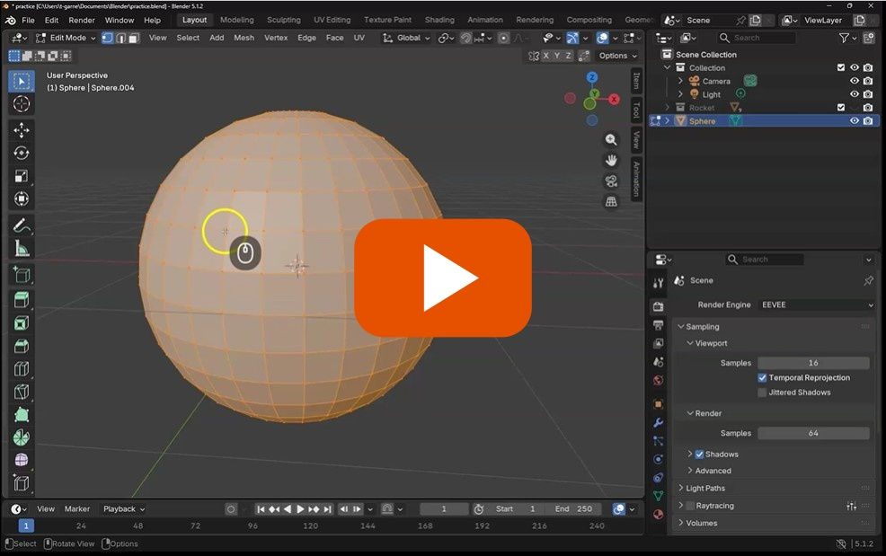](https://uwe.cloud.panopto.eu/Panopto/Pages/Viewer.aspx?id=a81b9d35-2ad5-48ac-ac98-b47400bb54b8)

Tips:
- Double click edges or faces to select whole loops.
- Hold **shift** to select multiple items.
- The are different ways to select multiple components, 

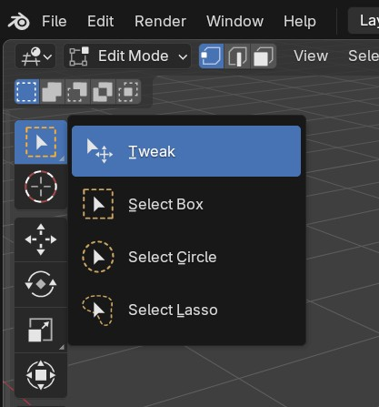

## 8. Triangle count

There is a video at the bottom of this section if you get stuck.

### Outliner

For the assignment you will need to stick to a triangle count. Each four sided face on your object (a quad) is made up of two triangles.

To find out how many triangles in your whole model turn on **Statistics** in the **Overlays** menu.

### Changing triangle count

When making new primitive's, you can change the number of polygons

- Add a new **uv sphere**
- change the segments and see how it changes the triangle count.

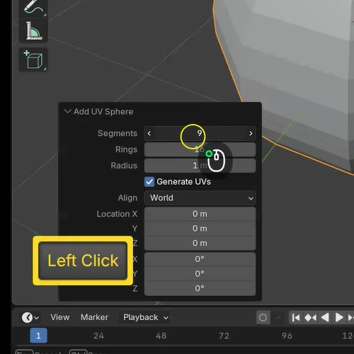

### Deleting

To delete an object, or component, just press the **delete** key on your keyboard.
choose **disolve** if you do not want to make a hole.

This video show you how to display the triangle count if 

[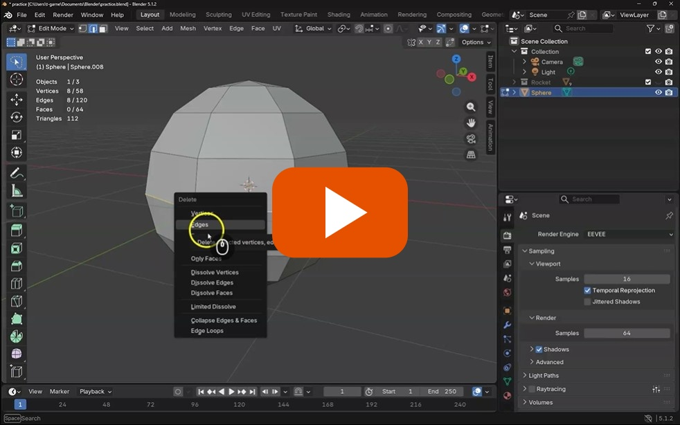](https://uwe.cloud.panopto.eu/Panopto/Pages/Viewer.aspx?id=0e590226-9aaa-4f09-bb8b-b47400c1b3fa)

#### Warning
Be careful not to add new primitives when in **edit** mode unless you really need to.

## 7. Materials

We can add material to whole objects, or individual faces using by adding new materials in the **material property** area.

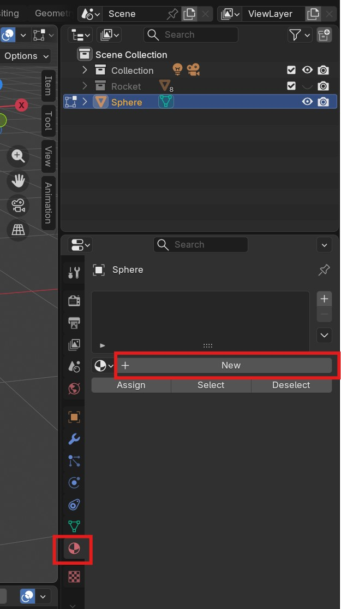

You can then change the properties of the material, including the colour

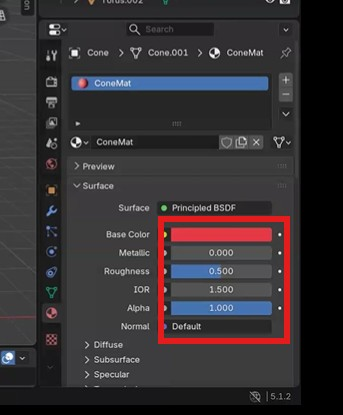

You can add a material to the whole object, or just the selected faces in edit mode.

- Try to add colours to the different elements of your rocket.

In this video I will show you how to add multiple materials to one object:

[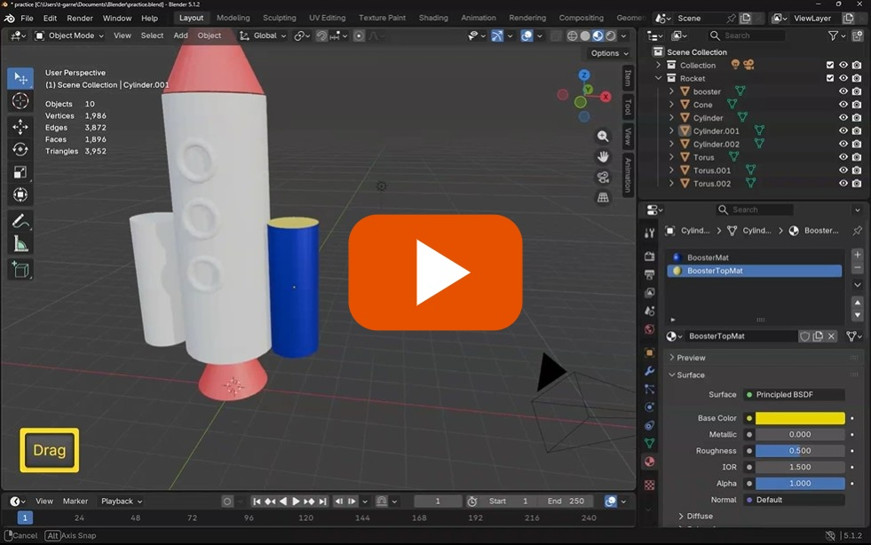](https://uwe.cloud.panopto.eu/Panopto/Pages/Viewer.aspx?id=067bebdc-2b0d-4f6f-9fc1-b47400c81f12)

Tip:
Make sure you are in the correct shading mode.
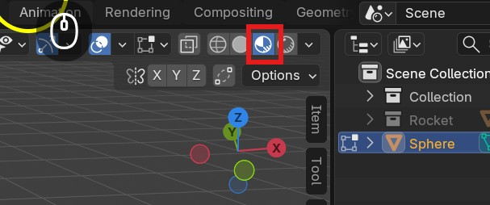

In future worksheets we will delve deeper into adding images and texture painting.

## 8. Extra challenge - make a creature.

For more practice, using the skills you have learnt in this worksheet  make a low poly vehicle. 

Think about which primitive most closely resembles your vehicle.

Add colours

Save regularly!

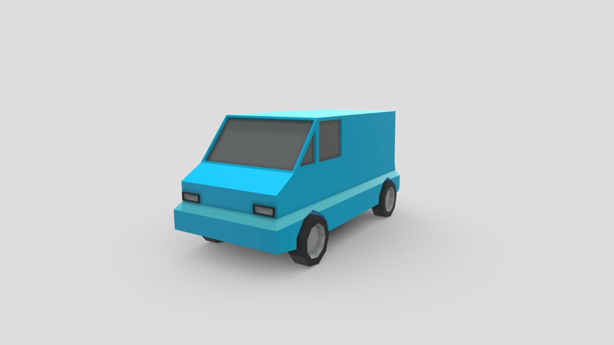

We will cover more advance modelling tools in future weeks, but here are some tips if you want to add more detail to your primitive shapes.

#### Tips:

Next week we will cover tools, but you may find these useful to add more edges to your objects:

### Poke Face
Select the end face of a cylinder and select **poke face** from the face menu

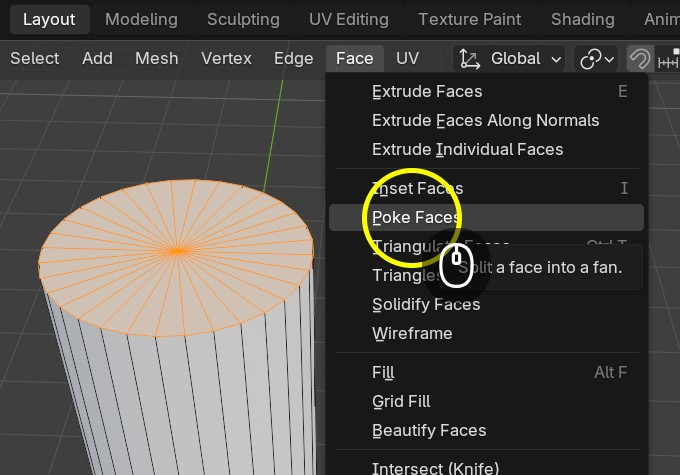

### Loop Cut
To add more edges use the loop cut tool

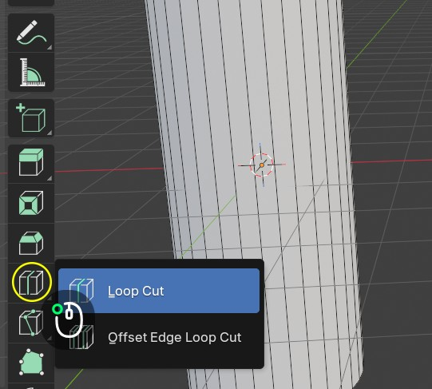

## Extra resources
[Blender 5.1 Manual](https://docs.blender.org/manual/en/latest/index.html)

[Blender Cheat Sheet](https://raw.githubusercontent.com/nachazo/blender-cheat-sheet/main/blender-cheat-sheet.png)

[YouTube short course](https://www.youtube.com/watch?v=kVcY7K-JA1Y&list=PLn3ukorJv4vv9_e-htADGsPX9TMaQpHV8)

## Sources

[sketchfab fan](https://skfb.ly/on9ro)

