# More modeling

In this worksheet we will cover more advance modeling techniques and tools.

## 1. Box modeling

This is a common modeling technique, you start with a primitive shape which most closely resembles your object and add gradually add more detail.

## 2. Extrude, Edge loop, insert

In order to box model we may need to add more edges to our primitive meshes.

We can do this in edit mode using the **loop cut**, **Extrude** and **insert** tools

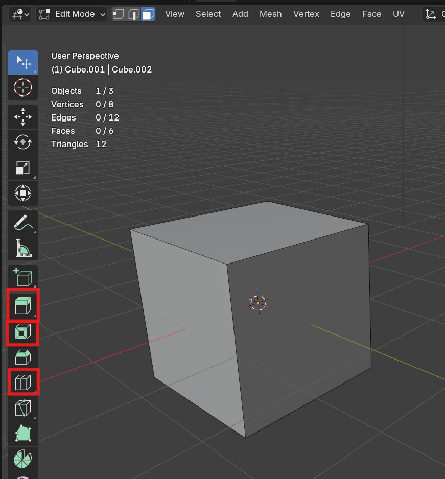

[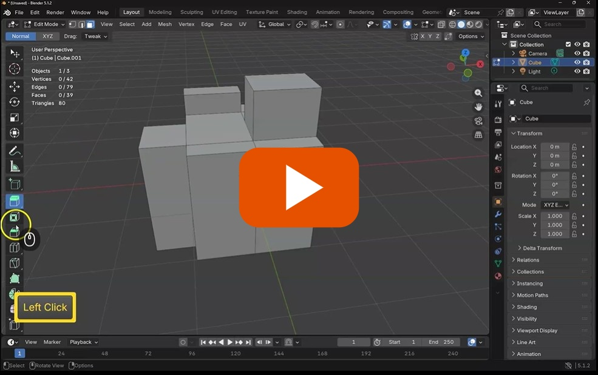](https://uwe.cloud.panopto.eu/Panopto/Pages/Viewer.aspx?id=b3fdbe26-84be-496b-a121-b47400f8983e)

## 3. Bevel and knife

The bevel and knife tools are also useful to add more detail, be careful you don't add too many segments when bevelling.

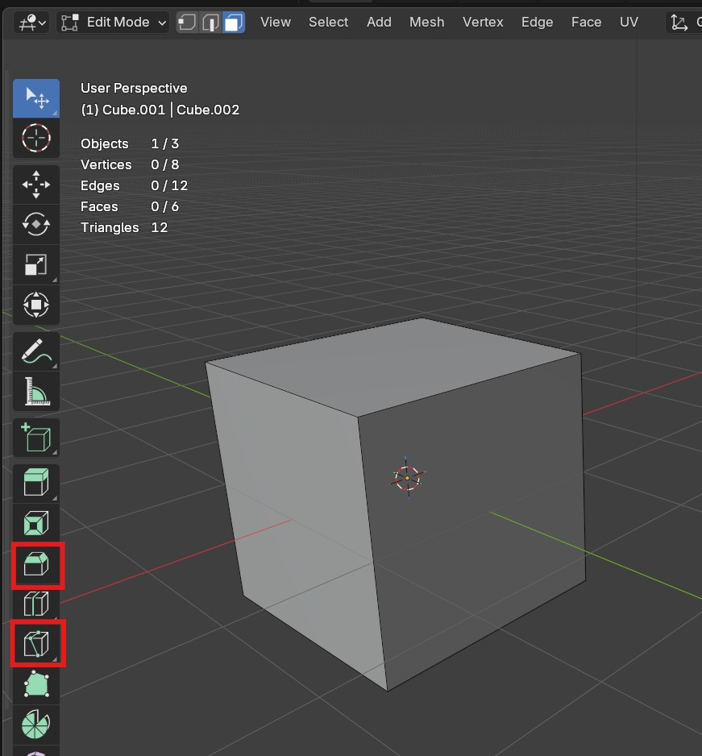

[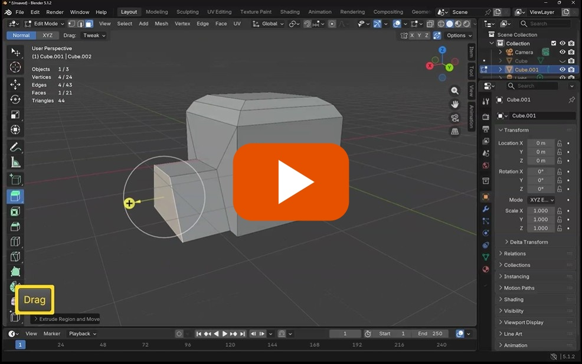](https://uwe.cloud.panopto.eu/Panopto/Pages/Viewer.aspx?id=91ef1d4a-4c73-4890-b58d-b47400fef358)

## 4. Challenge 1 - make a crate

Try to make a classic crate using the tools you have learnt today, you can include cross bars

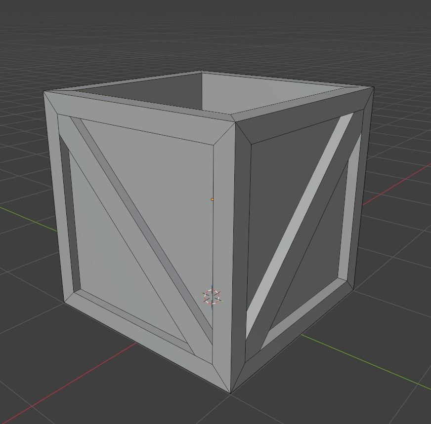

There is more than one way to do this, but try it yourself before looking at my solution.

[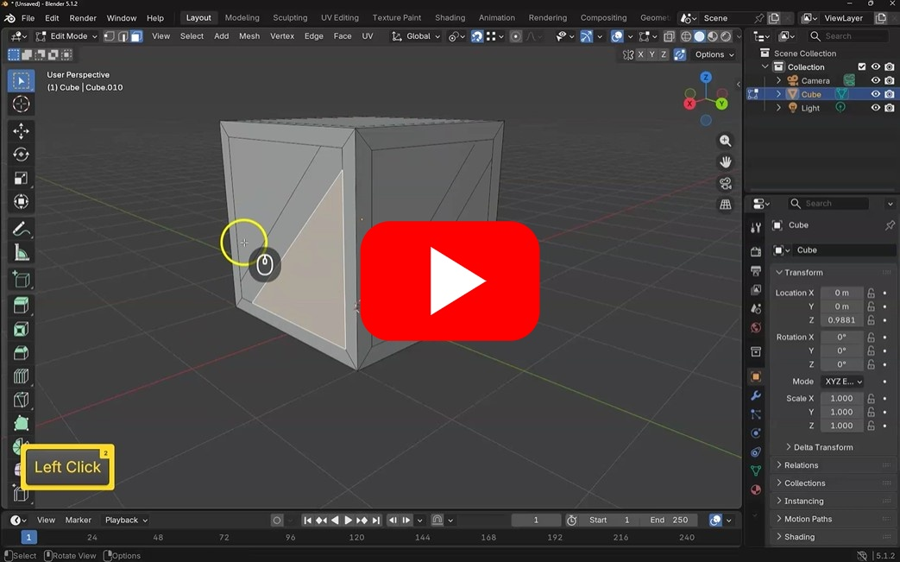](https://uwe.cloud.panopto.eu/Panopto/Pages/Viewer.aspx?id=c5849cff-9297-41a3-94bf-b48a01043a73)

## 5. Parenting and Collections

If you object is made from multiple parts it can be helpful to group them together.

- To parent an object to another press **ctrl + p**
- To add objects to a new Collection press **m**

[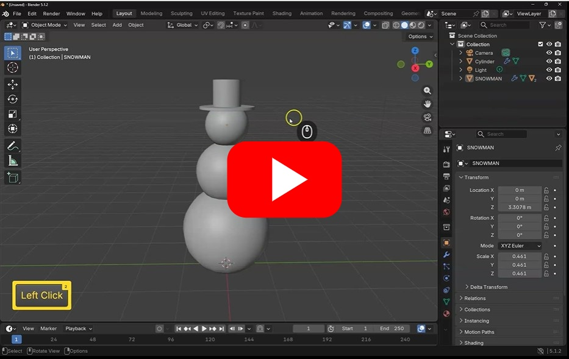](https://uwe.cloud.panopto.eu/Panopto/Pages/Viewer.aspx?id=285da0f8-c656-4fae-a9f9-b48a0112997b)

## 6. Origin

It can be very helpful to change where the rotation point of a object is.

you can do this using the origin only option

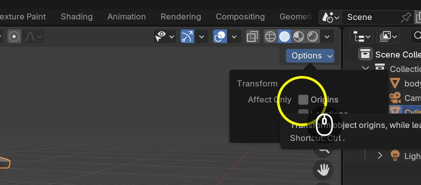

[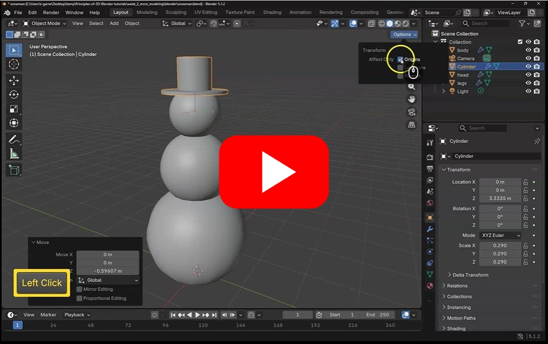](https://uwe.cloud.panopto.eu/Panopto/Pages/Viewer.aspx?id=09255292-8b1e-4b8c-b535-b48a01174244)

## 7. Challenge 2 - make a lid for the box

Create a simple lid for the crate, move the orign of the lid so that it is where the hinge should be

Group the lid and crate so that the lid is a child of the crate.

Try to do this yourself before looking at my solution bellow

[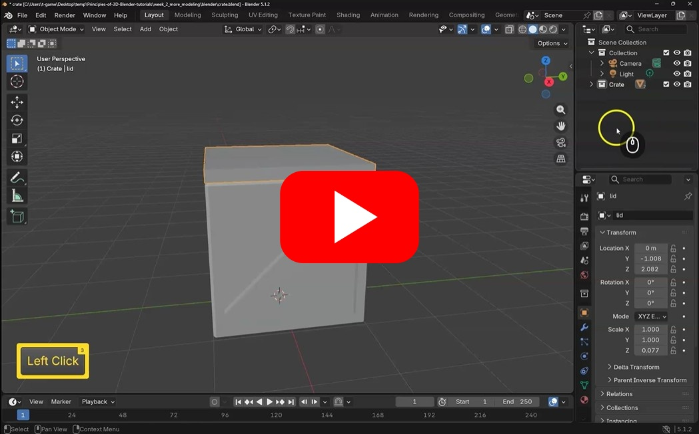](https://uwe.cloud.panopto.eu/Panopto/Pages/Viewer.aspx?id=37374a9a-f0b6-4f16-82fc-b48a011e6f01)

## 8. Modifiers

If our object is symmetrical or repeated the mirror and array tools can speed up our workflow

### Mirror modifier

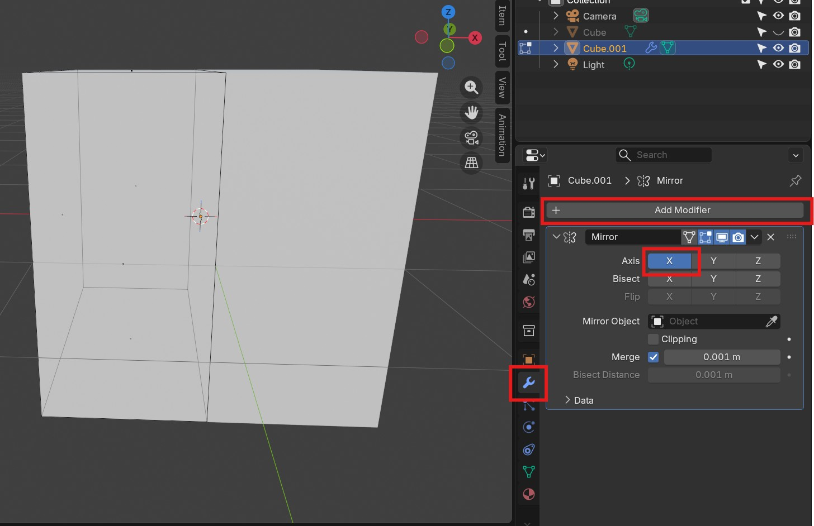

Mirroring is best done if your object is directly on the origin (the center of the scene).

Add a loop cut in the middle where you want to mirror

Delete half the object

Apply the mirror modifier in **object** mode (not edit mode)

Select the correct axis.

### Array

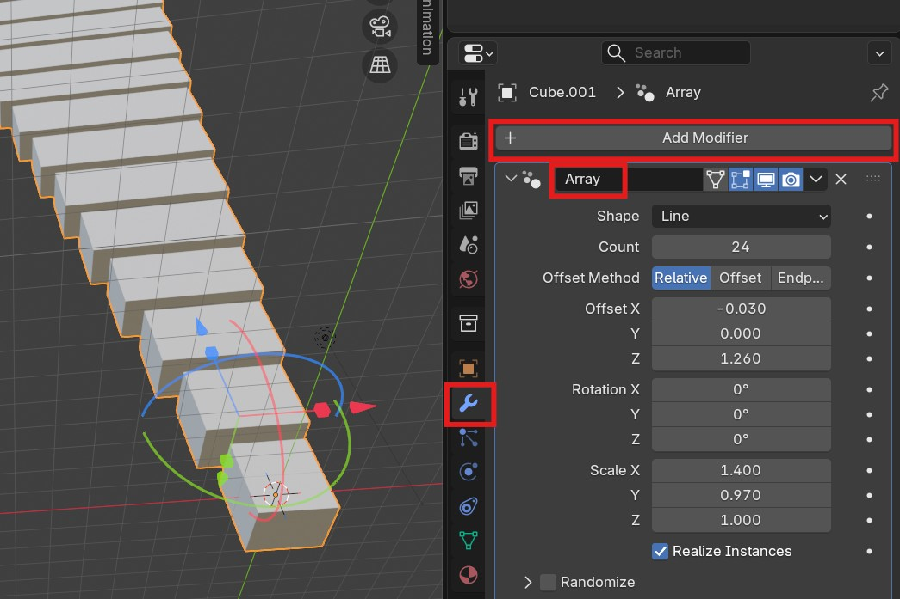

Arrays are useful if you want to repeat your object in a pattern.

* Select the object
* Choose the **Array** modifier
* Change the settings to what you want

[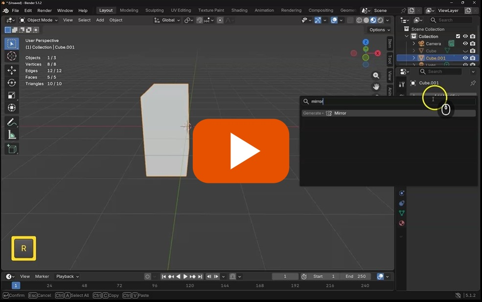](https://uwe.cloud.panopto.eu/Panopto/Pages/Viewer.aspx?id=4dcfc841-7e67-42f7-9a65-b4740105ffb0)

## 9. Join and fill

When making more complex models, it can be useful to be able to fill in holes and join with other meshes.

Press **f** to fill
Press **J** to create and edge between vertexes

[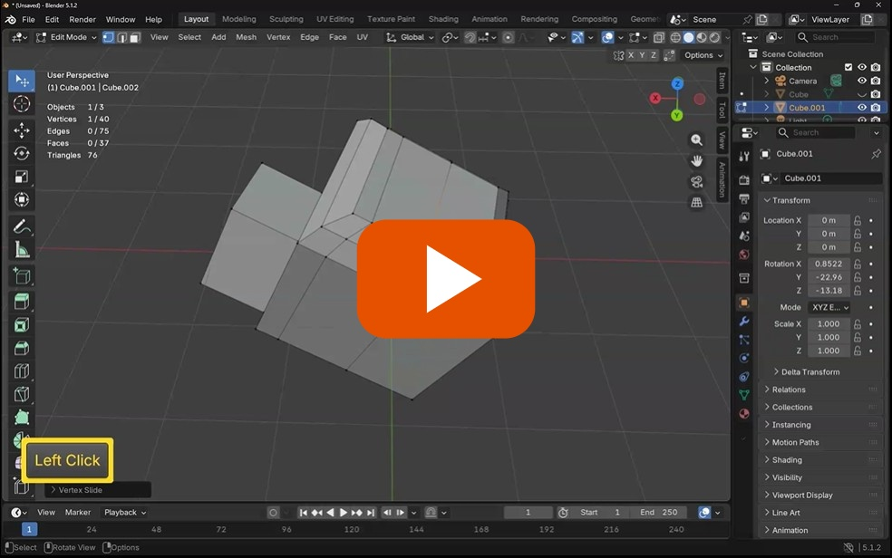](https://uwe.cloud.panopto.eu/Panopto/Pages/Viewer.aspx?id=504d2214-ac0b-43a0-bd76-b4740102871d)

## 10. Extra Challenge

If you have quickly made your way thought this worksheet, as an extra challenge
Try to model a simple low poly vehicle using the techniques you have learnt

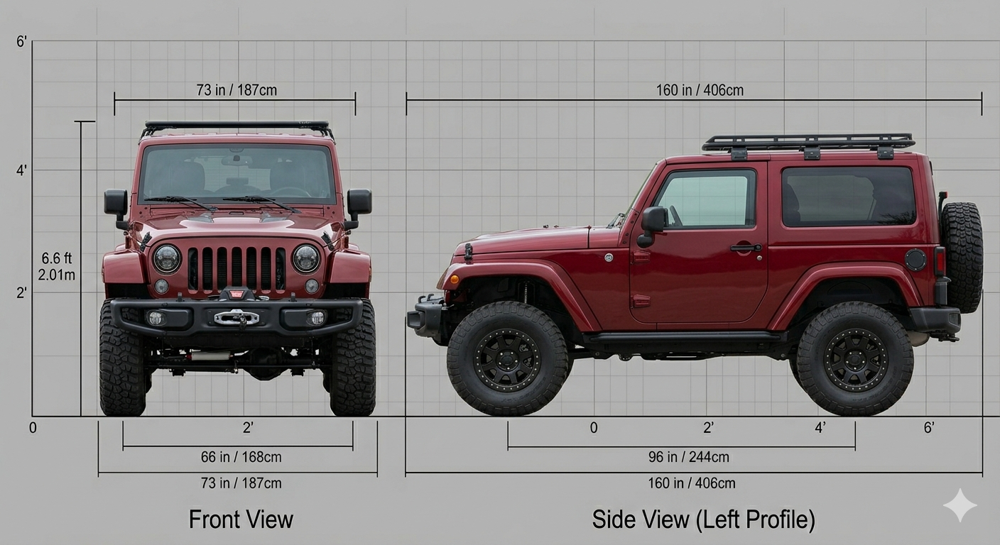

Use the following techniques

- Mirroring
- Insert
- Extrude
- Knife

Here is my solution, yours will be different.

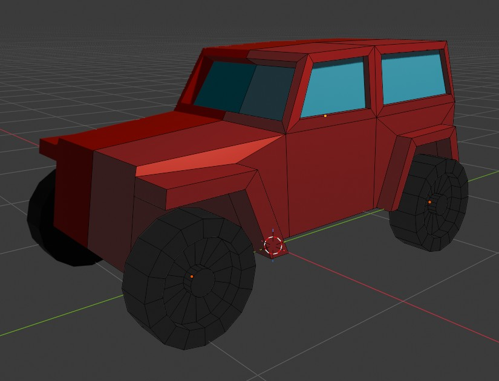

