# More modeling

In this worksheet we will cover more advance modeling techniques and tools.

## 1. Box modeling

This is a common modeling technique, you start with a primitive shape which most closely resembles your object and add gradually add more detail.

## 2. Extrude, Edge loop, insert

In order to box model we may need to add more edges to our primitive meshes.

We can do this in edit mode using the **loop cut**, **Extrude** and **insert** tools

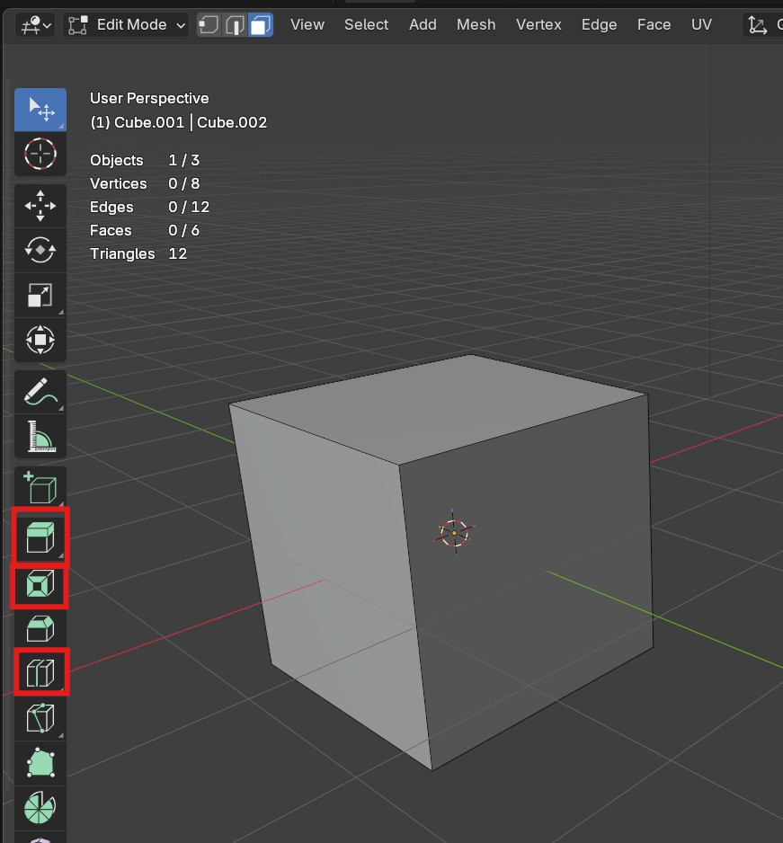

[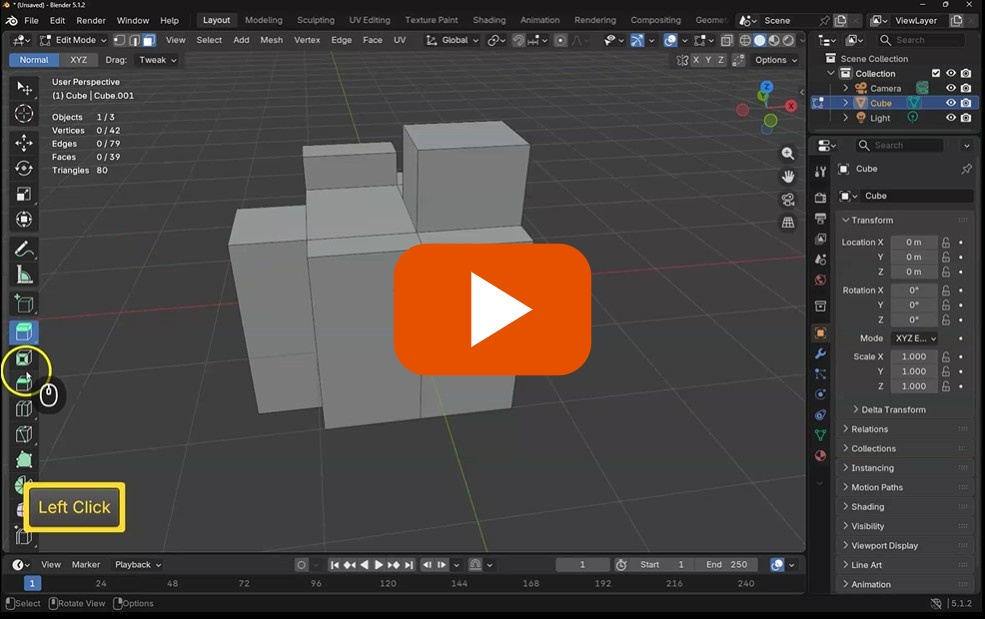](https://uwe.cloud.panopto.eu/Panopto/Pages/Viewer.aspx?id=b3fdbe26-84be-496b-a121-b47400f8983e)

## 3. Bevel and knife

The bevel and knife tools are also useful to add more detail, be careful you don't add too many segments when bevelling.

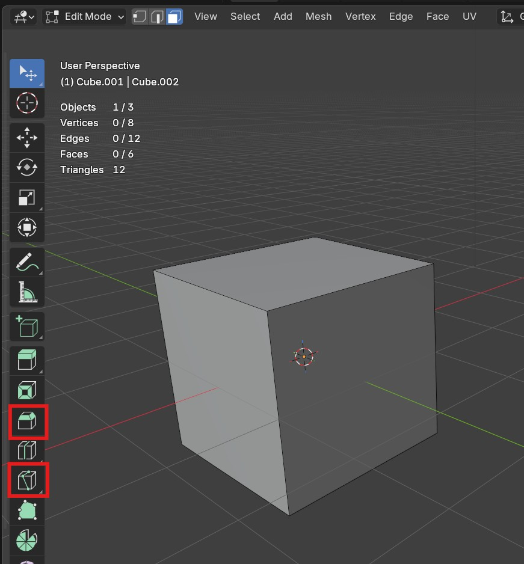

[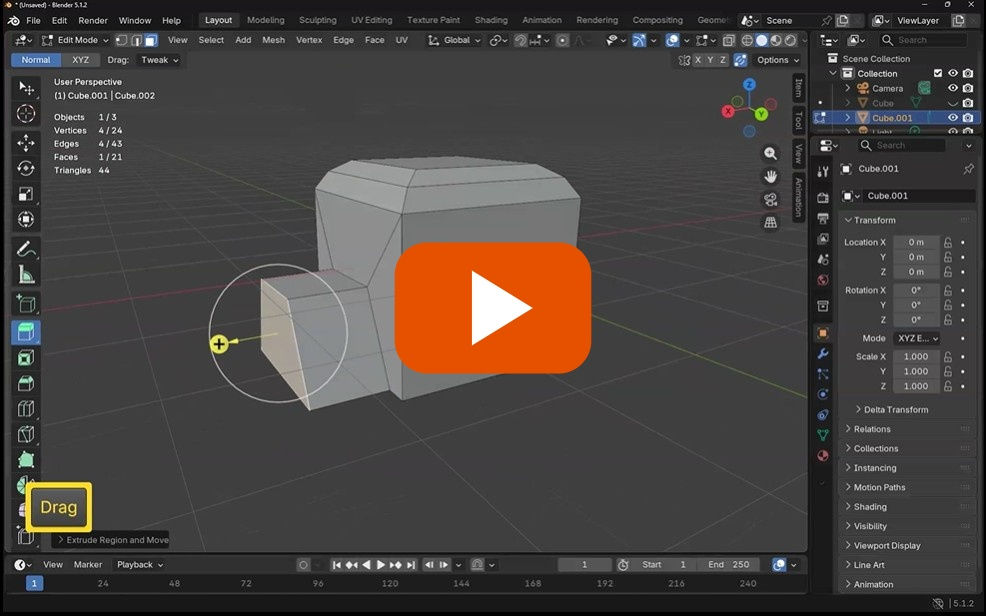](https://uwe.cloud.panopto.eu/Panopto/Pages/Viewer.aspx?id=91ef1d4a-4c73-4890-b58d-b47400fef358)

## 4. Modifiers - mirror - array

If our object is symmetrical or repeated the mirror and array tools can speed up our workflow

### Mirror modifier

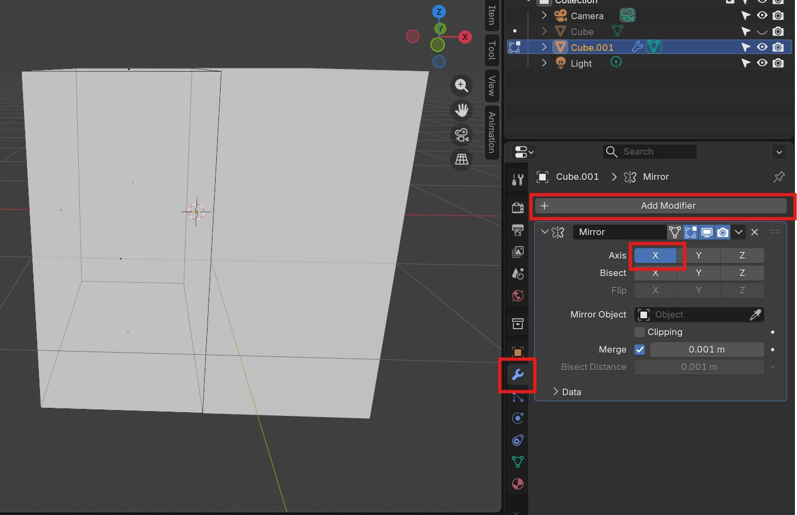

Mirroring is best done if your object is directly on the origin (the center of the scene).

Add a loop cut in the middle where you want to mirror

Delete half the object

Apply the mirror modifier in **object** mode (not edit mode)

Select the correct axis.

### Array

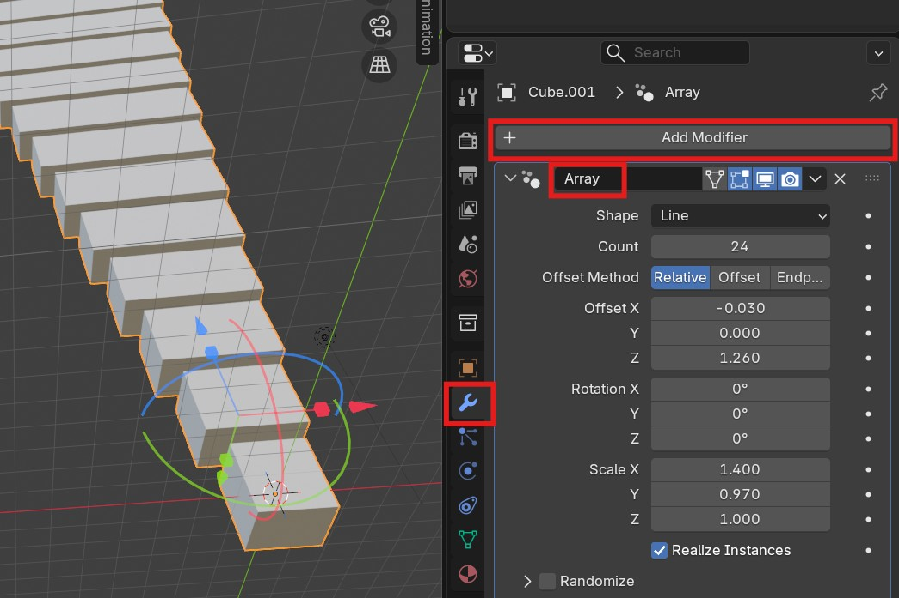

Arrays are useful if you want to repeat your object in a pattern.

* Select the object
* Choose the **Array** modifier
* Change the settings to what you want

[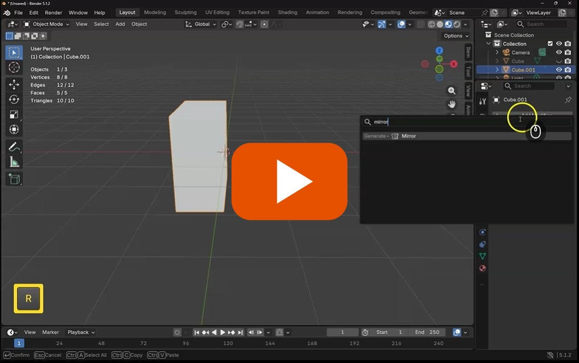](https://uwe.cloud.panopto.eu/Panopto/Pages/Viewer.aspx?id=4dcfc841-7e67-42f7-9a65-b4740105ffb0)

## 5. Add image reference

When modeling, its very helpful to have an image reference.

You can bring them into Blender by just dragging them into the scene, and then reseting the rotation and position as you need.

[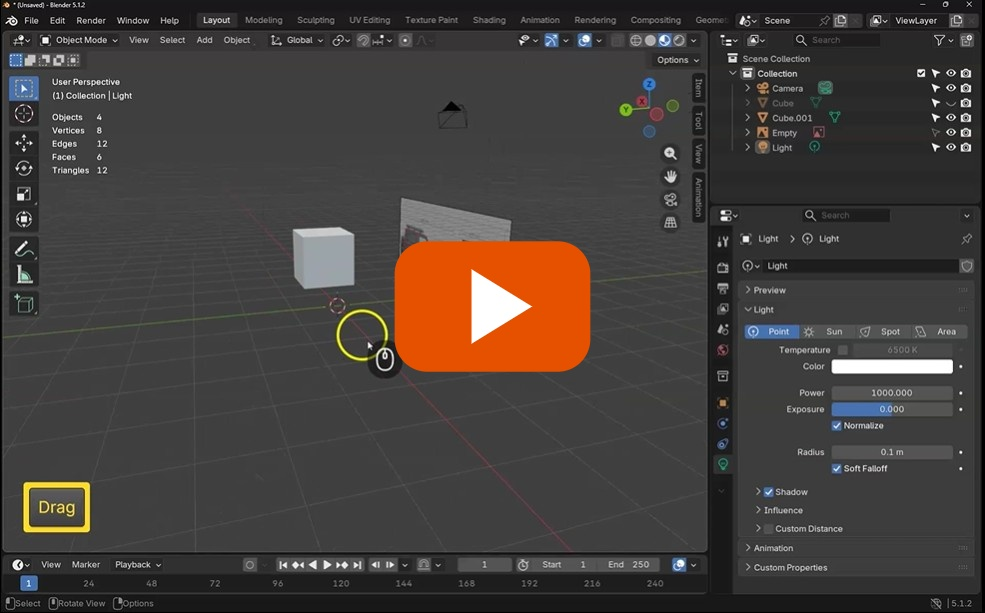](https://uwe.cloud.panopto.eu/Panopto/Pages/Viewer.aspx?id=ea48dea2-c8b5-4910-b45d-b474010a9358)

## 6. Challenge 1 - Model a low poly Jeep

Use the skills you have learn to model a Jeep, just create the basic shape, including windows, and wheels.

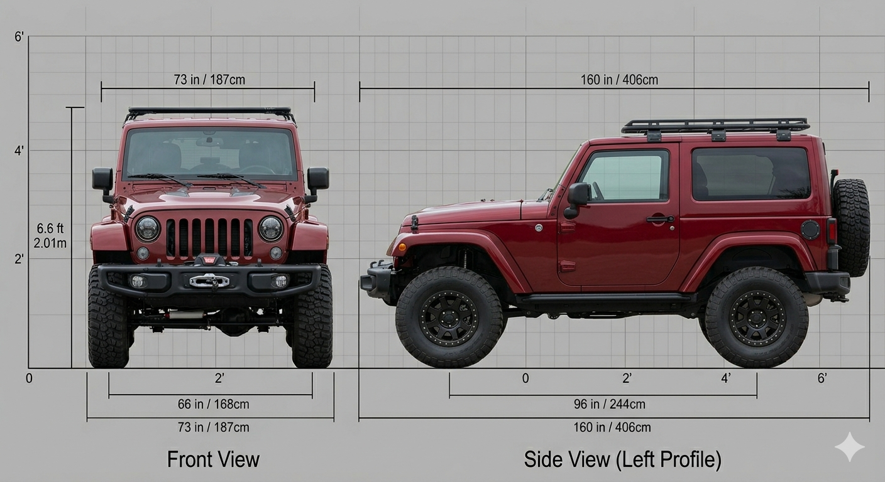

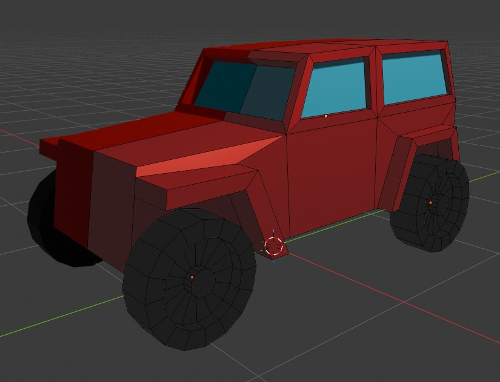

Here is my interpretation, you do not have do the same thing as me, but try to use all the skills you have learnt.

1. Start with a cube and add a loop cut to setup mirroring

2. Add another loop cut to extrude out the bonnet.

3. Adjust the edges to create the slope on the window screen

4. Add an extra loop cut  to create 2 faces for the side windows

5. Use insert to create the window frames and extrude the windows back into the body

6. Use the knife tool cut and then extrude the wheel arches.

7. Lastly, make the wheels as new objects from cylinders.

Try to do this yourself before looking at my solution video

[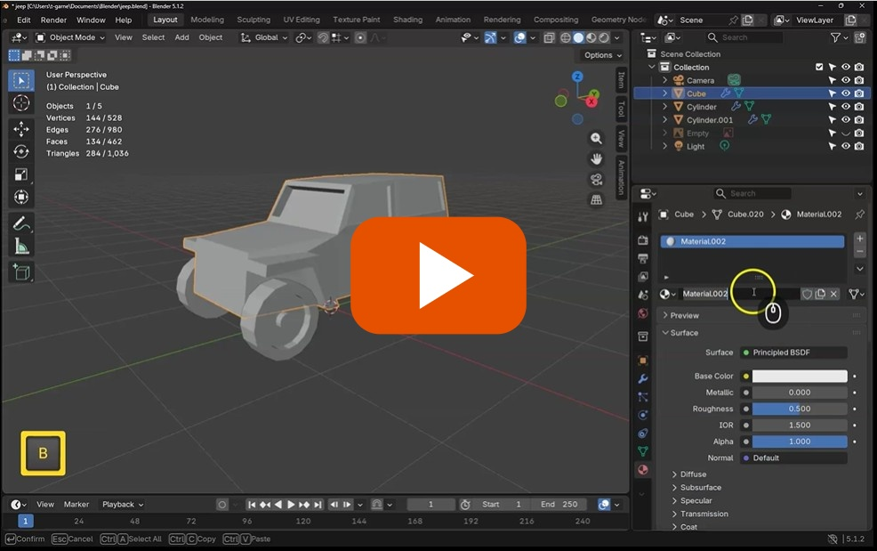](https://uwe.cloud.panopto.eu/Panopto/Pages/Viewer.aspx?id=89ddb0eb-f7ee-4ffe-b071-b47500b2cb1a)

