# Organic objects and texture painting

In this worksheet we will look at modeling more organic objects from an image reference, and applying more complex textures.

Follow along practice using Blender by creating a  n organic object and texturing it.

## 1. Soft edges

By default, all edges in Blender are sharp, this makes curved shapes look very faceted.

One way to make them look more smooth is by adding more edges

But this can increase the polygon count considerably.

A better solution is to mark the edges as smooth or sharp

- Hold down **Right click**
- Choose **Shade Auto smooth**

You can also smooth or sharpen individual edges.

This video shows you this in more detail:

## 2. Randomise

Organic objects are never perfect, you can make objects look more real by randomising the vertexes a little.

- In **Edit mode** Select the vertexes
- On the top menu choose **Mesh > Transform > randomise**

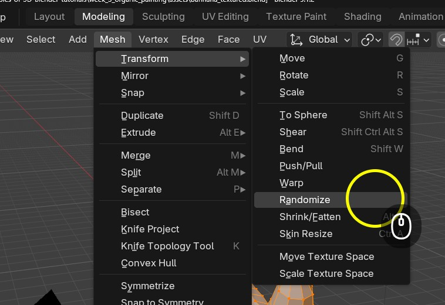

This video will show you how to do this in more detail :

[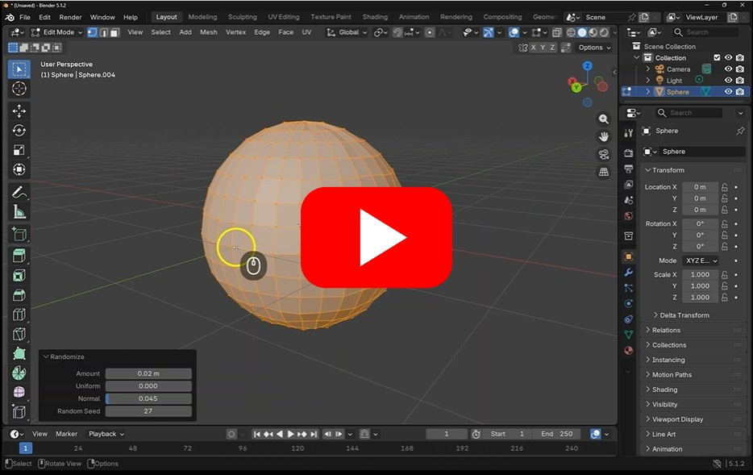](https://uwe.cloud.panopto.eu/Panopto/Pages/Viewer.aspx?id=d9a11d20-974f-403f-8a17-b498009eeacd)

## 3. Merge and edge slide

If you want to move edges along your shape, you can double tap **g** to edge slide your vertexes and edges.

turn on the merge option to merge vertexes that are on top of each other.

Watch this video to see this in action:

## 4. Add image reference

When modeling, its very helpful to have an image reference.

You can bring them into Blender by just dragging them into the scene, and then resetting the rotation and position as you need.

This video show you how to do this in practice:

[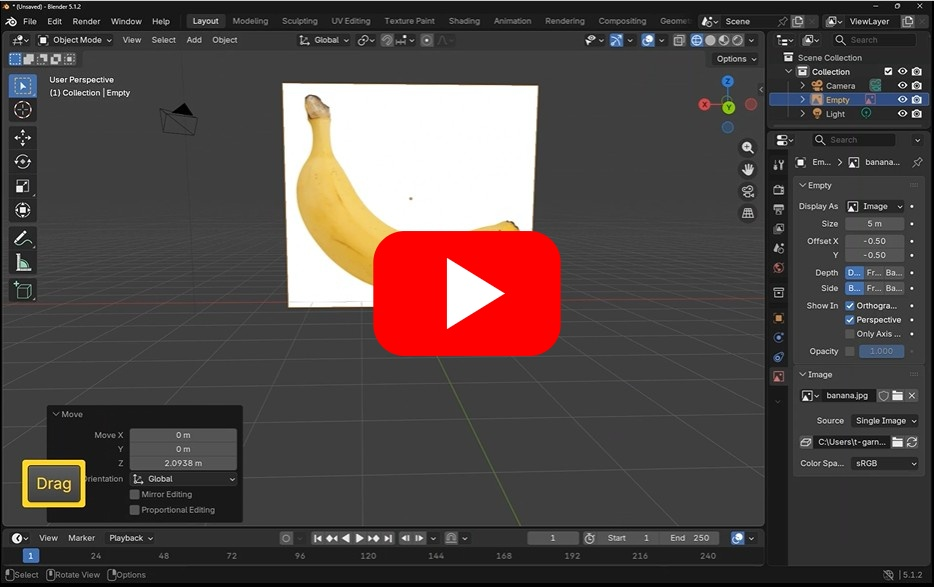](https://uwe.cloud.panopto.eu/Panopto/Pages/Viewer.aspx?id=44103c40-4722-45b5-8cea-b49800a14103)

## 4. Model an organic object

We can now try to model a low poly Banana

- Start with a new cylinder with 8 Sides.

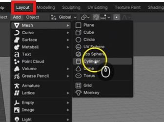

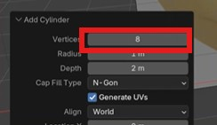

- Move and scale the cylinder in front of the image reference

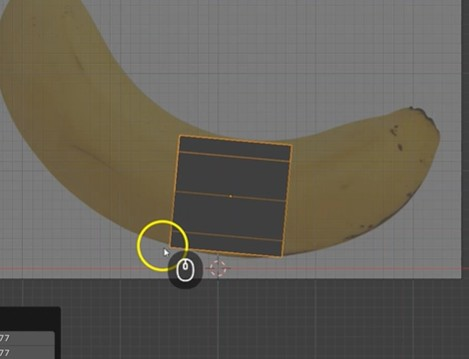

- You will find it easier if you are in the side view by pressing y or x on the Gimbal.

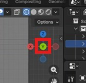

- In edit mode (hotkey tab) and edge selection (hotkey 2) double click the end to select the end face of the cylinder

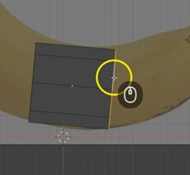

- Press **e** to extrude and move the mouse to drag out the next section of the banana

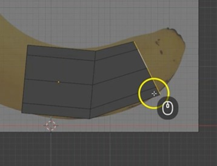

- With the new faces still selected move (hotkey g), scale (s) and rotate (r) them into position

- keep doing this until you have mode the whole fruit.

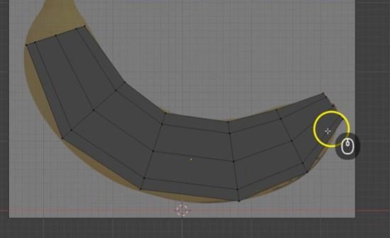

- lastly, you can poke the end face by going into face mode (3), selecting the end face, hold down the right mouse button and selecting poke

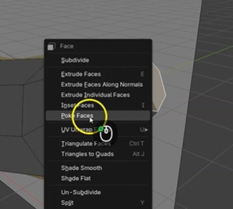

This video shows you how do to all this if you get stuck:

[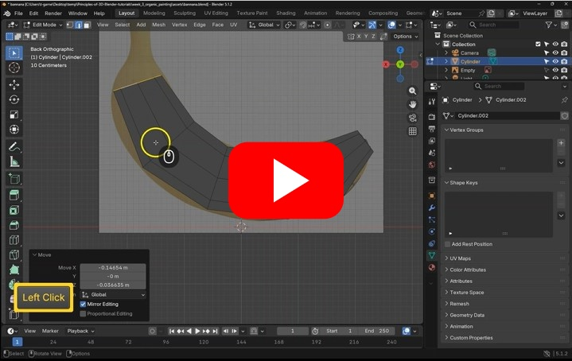](https://uwe.cloud.panopto.eu/Panopto/Pages/Viewer.aspx?id=5b6161b0-0493-461d-8c03-b49800a37eb9)

## 5. Basic uv mapping - automatic

We now want to paint our banana, next week we will cover other types of texturing.

Before we can paint we need to unwrap our UV's

- Go into the **UV editing** tab

- In edit mode (tab) select the whole banana.

- In the top menu, go to **UV > smart uv project** and press **unwrap**

To see this in more detail, or if you get lost you can watch this video:

[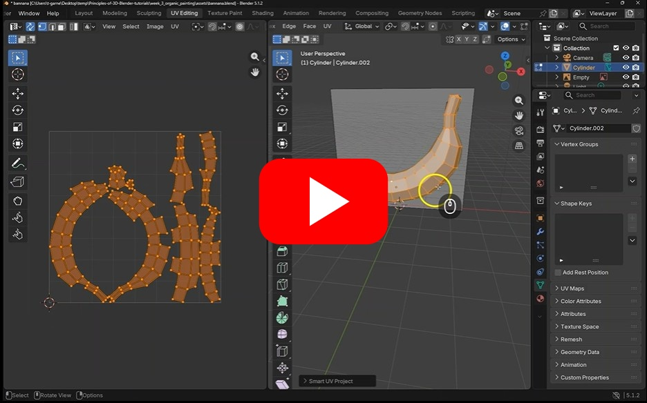](https://uwe.cloud.panopto.eu/Panopto/Pages/Viewer.aspx?id=58c4db8f-87b1-4c9c-80af-b49800abab35)

Next week we will go into uv unwrapping in more detail

## 6. Texture painting

We can now paint on our banana

Its a good idea to have a reference you can use for inspiration

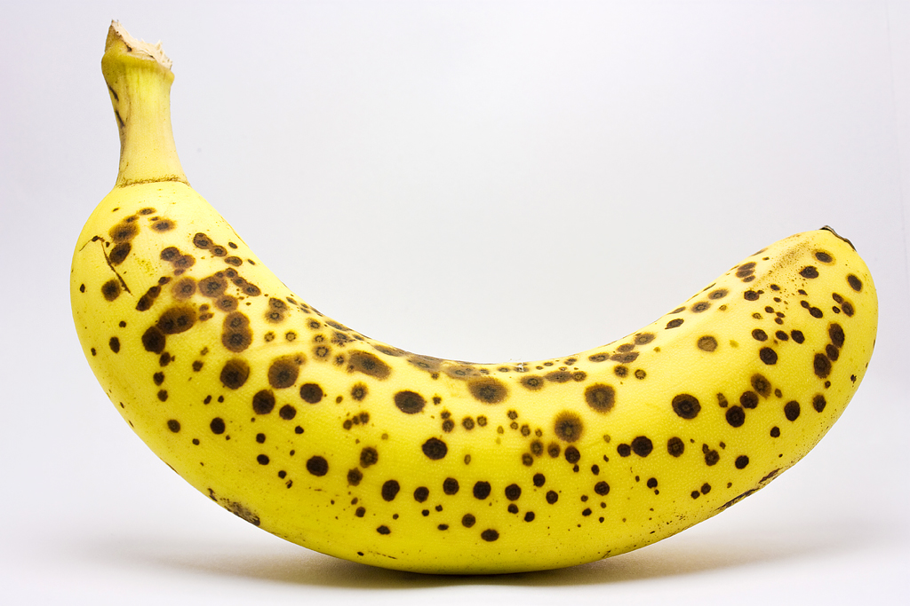

- Open the texture painting workspace

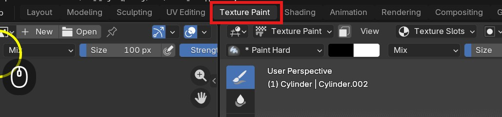

- Create a new image, and size to 2048px

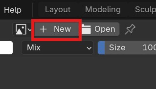

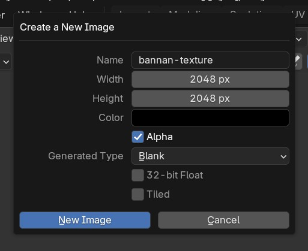

We now need to apply the image to the banana

- Create a new material on the banana

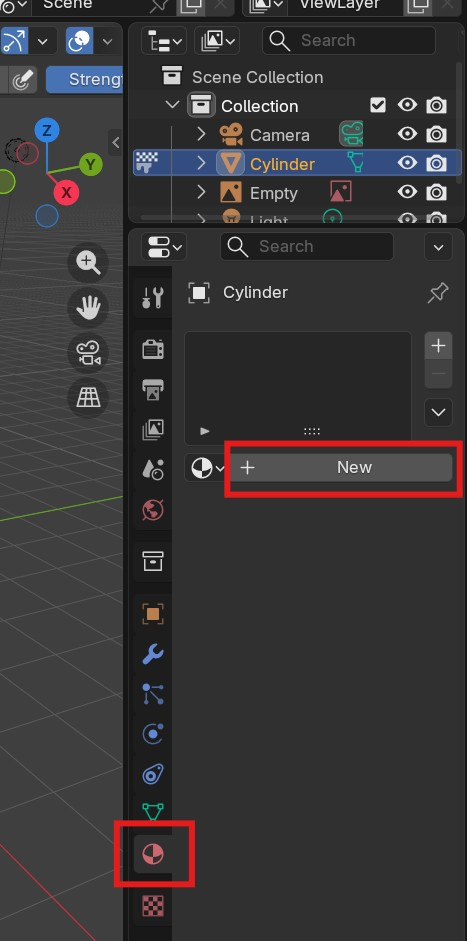

- Apply your banana texture image to the materials colour slot

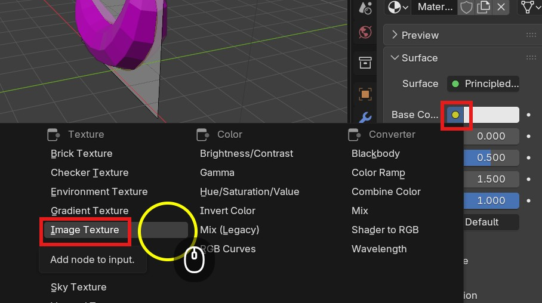

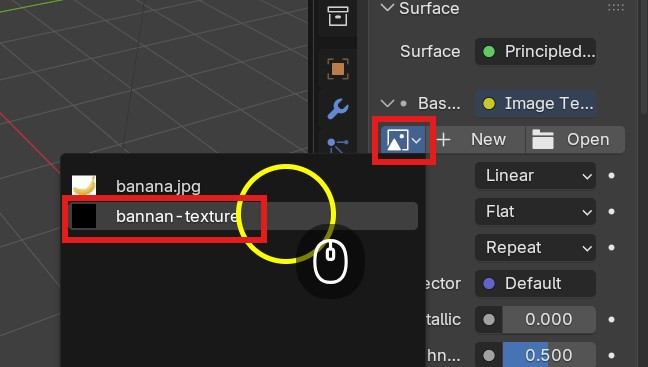

Your Banana should go black

You can now start painting on your banana.

### Painting

- Choose a nice banana yellow from the colour picker

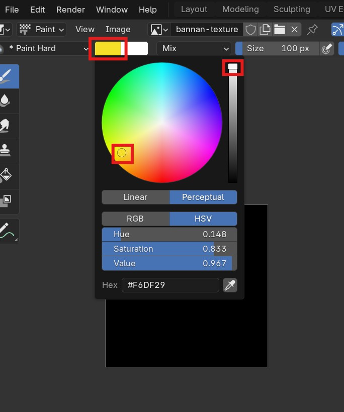

- flood fill the image to make it all yellow

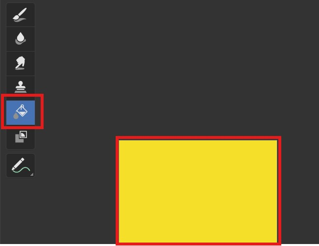

We can now draw in the detail using the paint brush

- Change the colour to brown
- Choose the paintbrush tool
- Select the airbrush tool on the bottom

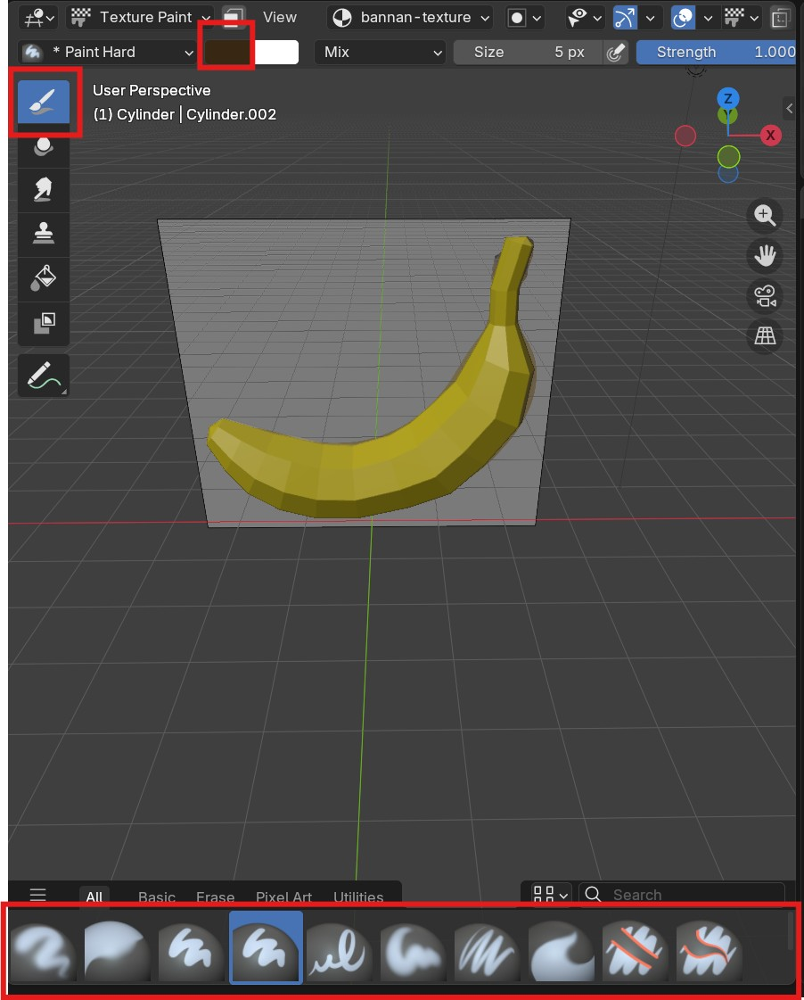

You can now paint spots and lines directly on your 3D banana

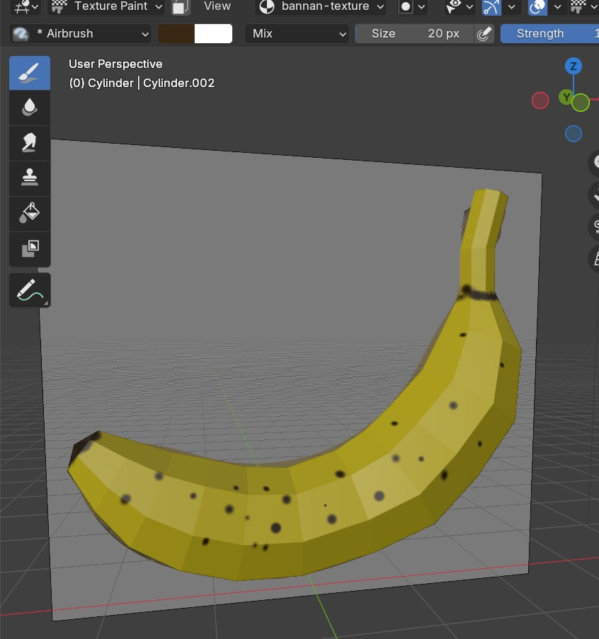

### Save

When you have finished, it is really important to save your image, save it to the same place as your Blender file.

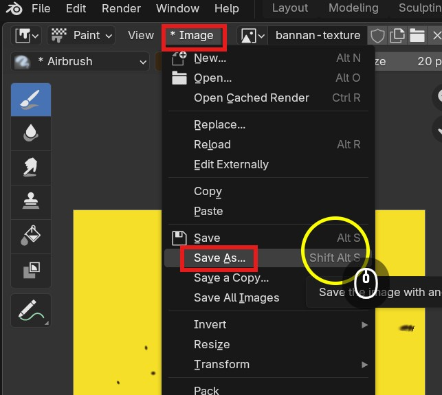

Please watch this video if you get stuck or would like to go over texture painting in more detail:

[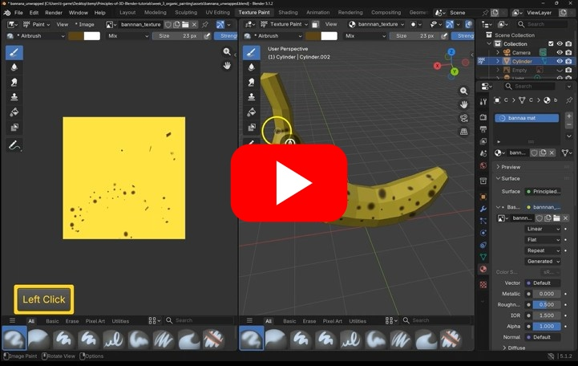](https://uwe.cloud.panopto.eu/Panopto/Pages/Viewer.aspx?id=a1b8bff4-f511-43ef-b74c-b49800ac7ee9)

## 7. Extra Challenge - Create another fruit.

If you would like more practice, find image references for another fruit and try to model and   texture paint it.

