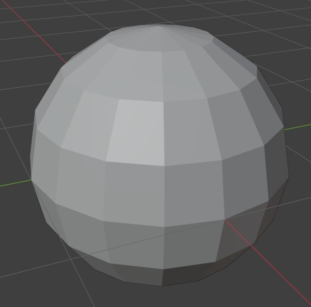
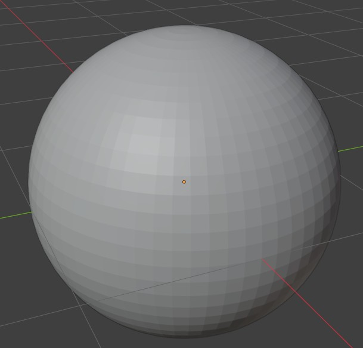
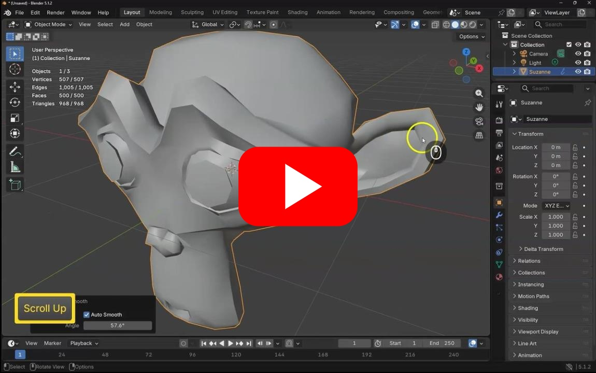
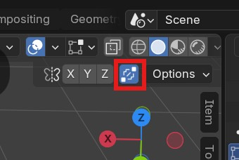

# Organic objects and texture painting

In this worksheet we will look at modeling more organic objects from an image reference, and applying more complex textures.

## 1. Soft edges

By default, all edges in Blender are sharp, this makes curved shapes look very faceted.

One way to make them look more smooth is by adding more edges

But this can increase the polygon count considerably.

A better solution is to mark the edges as smooth or sharp

- Hold down **Right click**
- Choose **Shade Auto smooth**

You can also smooth or sharpen individual edges.

## 2. Randomise

Organic objects are never perfect, you can make objects look more real by randomising the vertexes a little.

## 3. Merge and edge slide

If you want to move edges along your shape, you can double tap **g** to edge slide your vertexes and edges.

turn on the merge option to merge vertexes that are on top of eachother.

## 4. Add image reference

When modeling, its very helpful to have an image reference.

You can bring them into Blender by just dragging them into the scene, and then reseting the rotation and position as you need.

## 4. challenge - model  a banana

Find an image of a Banana and try to model it starting with a primative shape.

Import the imge reference and use mirroring if you find it helpful.

Try to do this yourself before looking at my solution.

## 5. Basic uv mapping - automatic

- freeze scale
- automatic unwrap

## 5. Texture painting

- Create new texture
- paint 
- save

## 6. Challenge - paint your banana

Find a few image references for a banana

try to recreate it in a 

