# Texturing and UV unwrapping

In this worksheet we will explore the shading workspace, adding PBR textures to our model.

We will also try to manual UV unwrapping.

- First create a new blender file and delete the default cube so you have an empty scene

- Save the scene somewhere sensible ( maybe a Blender folder in your onedrive)

## 1. Import a model

For this workshop we will use an existing model which we need to import.

- Download the following glb file and save it next to your blender file

[cactus glb file ](assets/cactus.glb)

- Import it into a new Blender file using **File > import > gltf 2.0**

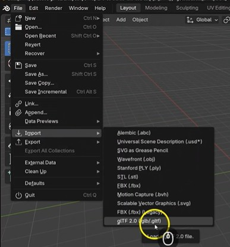

This video shows you how to do this if you get stuck:

[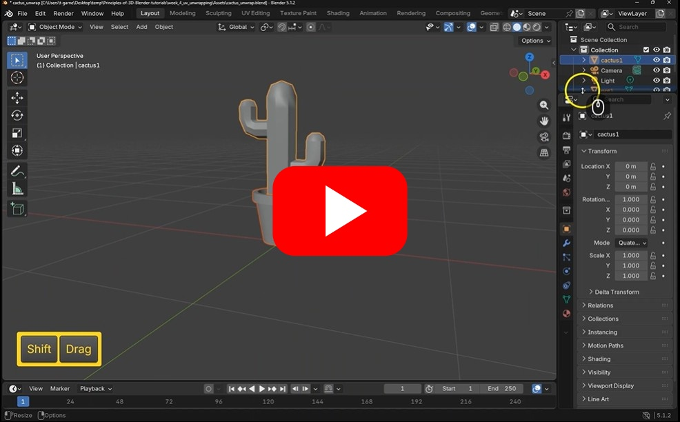](https://uwe.cloud.panopto.eu/Panopto/Pages/Viewer.aspx?id=3bbbf082-bd84-4e70-b5ad-b49800fa60e0)

## 2. Apply image using Shader editor

We can now add an image texture to the cactus.

- Download the following image and move it next to your blender file.

[giraffe texture](assets/giraffe.jpg)

- Select the **Shading** workspace

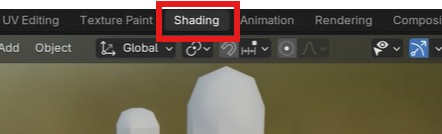

- Select just the cactus ( not the soil or pot)

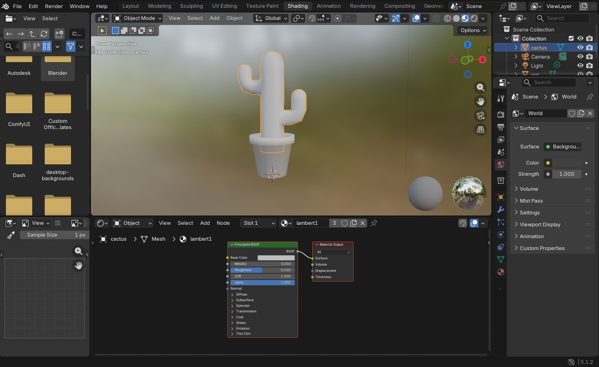

- Create a new materials and rename it

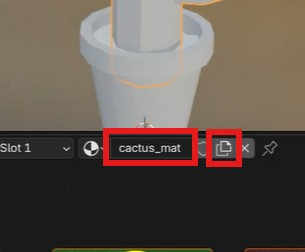

- Create a new image texture node by selection **Add > Texture > Image Texture** and place it next to the **principle BSDV** node.

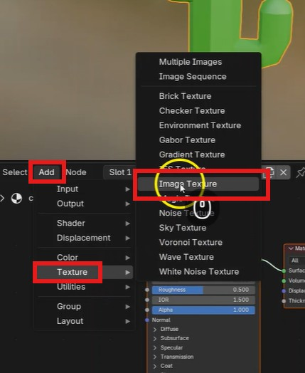

- Connect the color output of the **image texture** node to the **Base colour** input of the **Principle BSDF** node. ( the cactus should turn black)

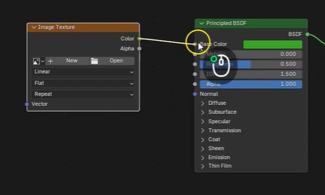

- Press **open** on the image texture node, and select the giraffe image you downloaded earlier.

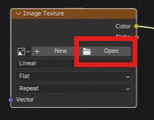

You should now see the giraffe texture on your cactus

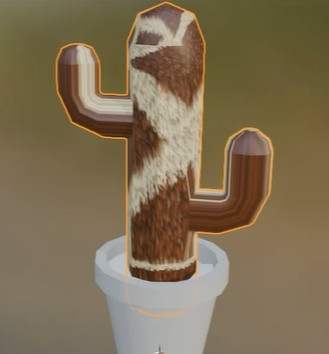

If you get stuck, this video show you how to add the image texture.

[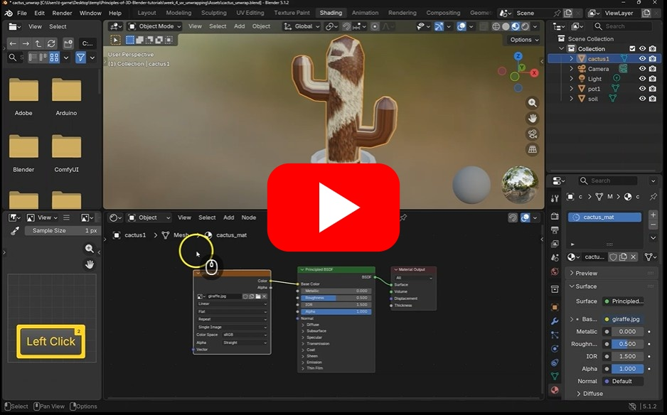](https://uwe.cloud.panopto.eu/Panopto/Pages/Viewer.aspx?id=9d4ab278-a796-48a7-8792-b49800fdda85)

## 3. Smart UV unwrapping

The texture is stretched on the arms of the cactus.

We need to uv unwrap the cactus to correct the stretching.

- Select the cactus and go into edit mode (tab)
- Press a to select all the components.
- On the menu, choose **UV > smart UV project**

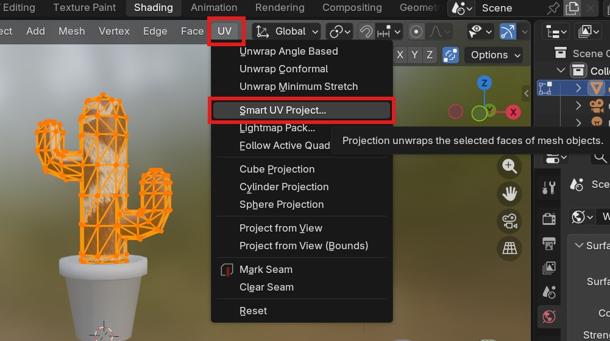

- then choose **Unwrap**

You can now exit edit mode (tab) and the texture should be less stretched.

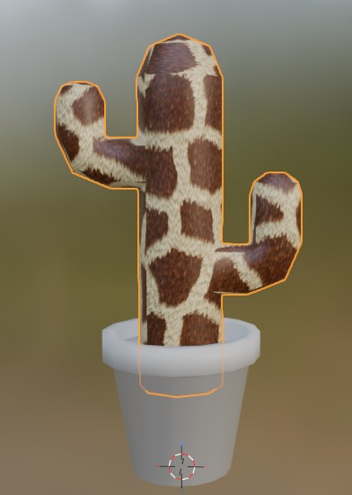

If you get stuck, this video show you how to use smart unwrap

[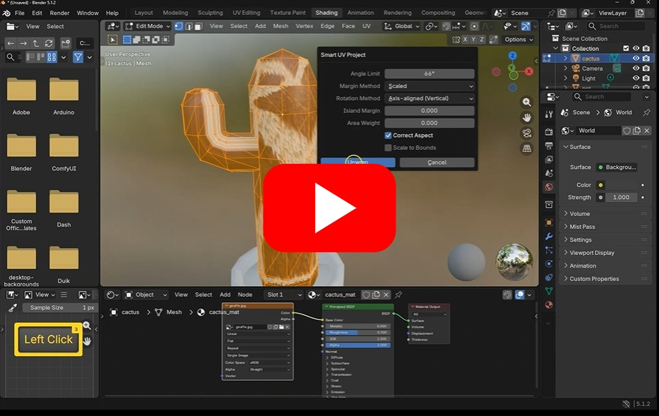](https://uwe.cloud.panopto.eu/Panopto/Pages/Viewer.aspx?id=8374253d-ee88-4488-9fb7-b498010ec217)

## 4. Node Wrangler and PBR textures

PBR(Physically based rendering) textures you find online will have multiple maps, other than the colour (diffuse) map you just used, you may also see a metallic, emissive, roughness and normal map images.

We can add these manually like we just did with the image, but an easier way is to use the **node Wrangler** plugin.

- Turn it on by going to **Edit > preferences**

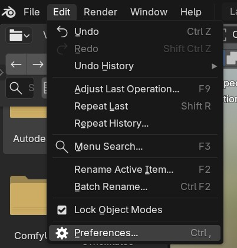

- In add-ons, turn on **Node Wrangler**

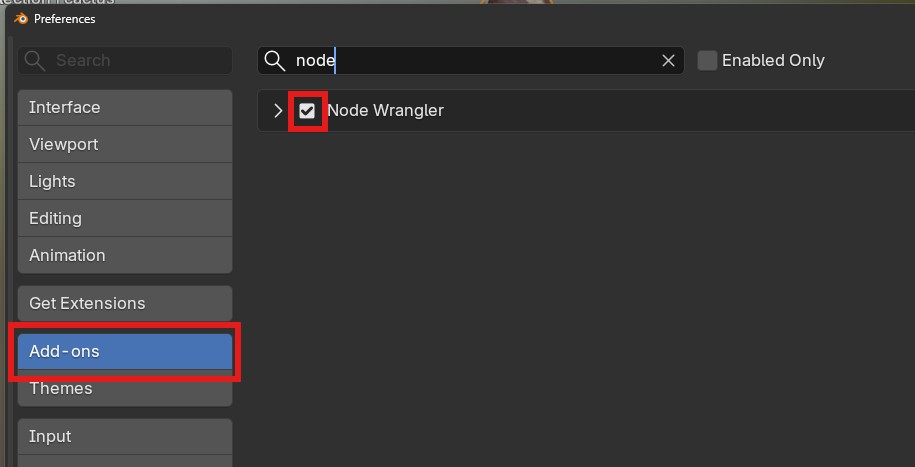

### Download a texture

We now need a PBR texture to apply to our cactus

You can find PBR materials for free here:

- [https://ambientcg.com/](https://ambientcg.com/)

- Download the 1k jpg version of one that you think looks interesting, I chose this one:

[https://ambientcg.com/view?id=Fabric018](https://ambientcg.com/view?id=Fabric018)

- You will now need to unzip it and put the folder next to your blender file.

## Apply texture

We can now apply the texture to our cactus.

- In the **Shader editor** delete the image node we added earlier

 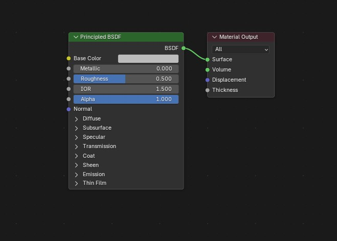

- Hover over the **Principle BSDF** node and press **ctrl + shift + t** on the keyboard to bring up the file viewer

- select the **color**, **normal gl**, **roughness**, **displacement** , **Opacity**, **metalic** and **emission** image maps you downloaded earlier, your texture may not have all of them.

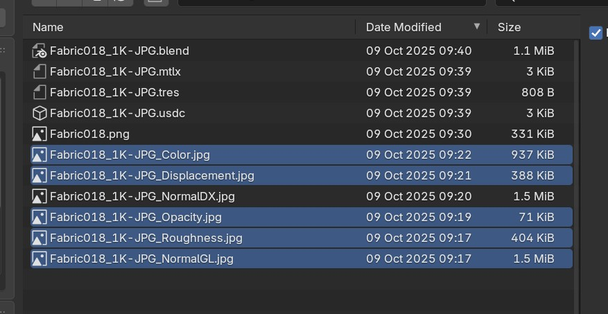

The node wrangler will now have plugged them all into you material for you

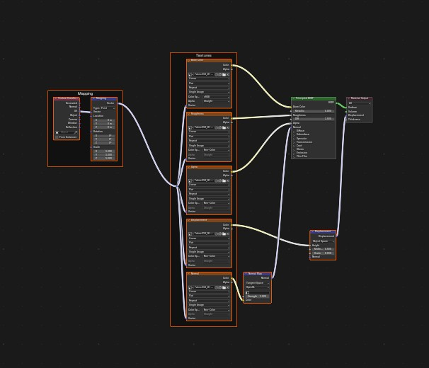

If you get stuck, this video show you how to use the node wrangler

[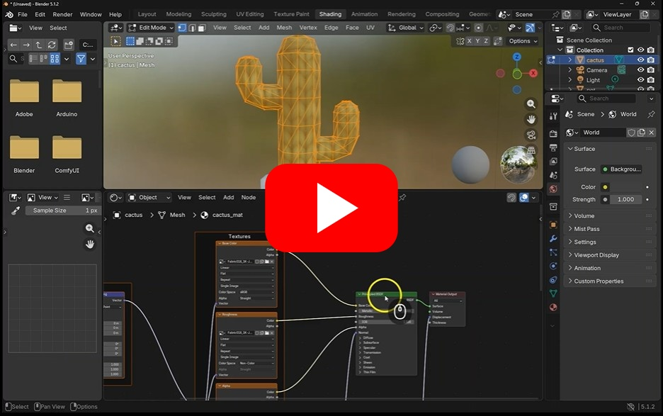](https://uwe.cloud.panopto.eu/Panopto/Pages/Viewer.aspx?id=83d906ee-555a-42ef-8ebd-b49801127522)

Tips:
- For your final coursework you may want to use a 2k or even 4k texture for your model.
- You can move and scale your material by altering the values in the Mapping node

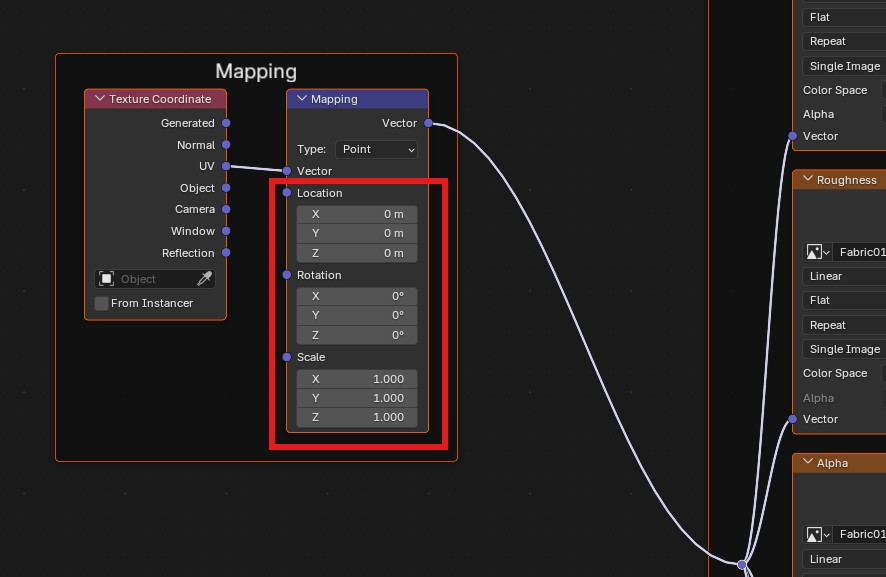

## 5. Challenge - Finish the Cactus

See if you can add textures to the soil and pot.

- Download pbr textures or just a base colour image
- Apply it to the pot and soil objects

## 6. Extra - Manual UV Unwrapping

Using smart unwrap normally gives you very good results, but if you want to go further and have more control over how your model unwraps this section will show you how to manually unwrap your model.

This video show you how to use manually unwrap your object

[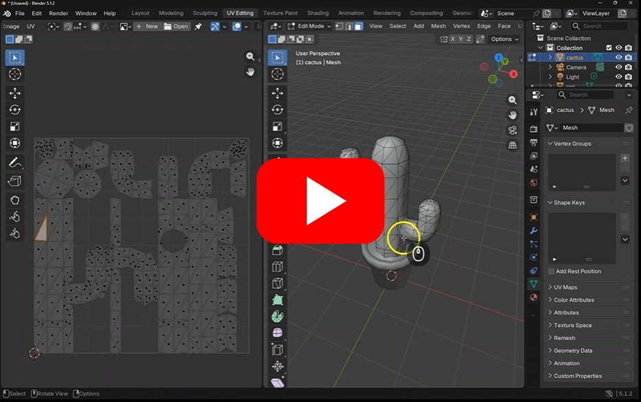](https://uwe.cloud.panopto.eu/Panopto/Pages/Viewer.aspx?id=a3eacb06-32dd-4273-bbd0-b49801150dad)

## 7. Resources

### free textures
You can download creative commons licenced prb textures from these sites without needing to login or create an account.
- [https://ambientcg.com/](https://ambientcg.com/)
- [https://polyhaven.com/](https://polyhaven.com/)

### Decals
You may want to apply decals to your models, they are useful for applying logos, or specific images as a layer over your main texture
- https://www.youtube.com/watch?v=TIkY5SFAusU

### Substance Painter
Substance painter is a powerful and fully featured tool for texturing models, I have made a serice of video showing the basic functionality.
- [substance painter playlist](https://uwe.cloud.panopto.eu/Panopto/Pages/Viewer.aspx?pid=3e0ac1c4-1ad4-4946-8318-b20d00e07035)

