# Rendering

In this worksheet I will guide you through adding lights, controlling the camera and finally rendering you scene to a an image file.

## Import assets

First you will need an object to render. I have given you a pumpkin model.

You can download it here:

[Pumpkin glb file](assets/pumpkin.glb)

Import it into a new Blender file using

**File > Import**

and choose

**glTF 2.0 (.glb/.gltf)**

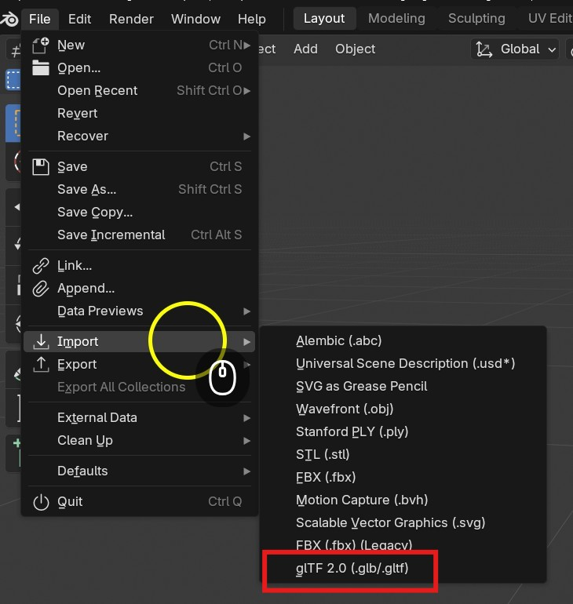

Here is a video showing you to do it if you get stuck:

[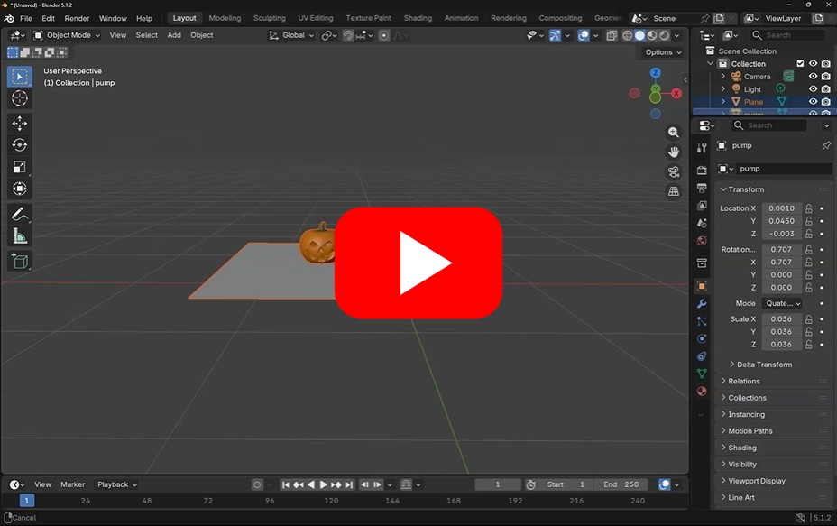](https://uwe.cloud.panopto.eu/Panopto/Pages/Viewer.aspx?id=df66ec03-7700-4826-93fe-b4940093d2b7)

## Camera

The default scene in Blender contains a Camera

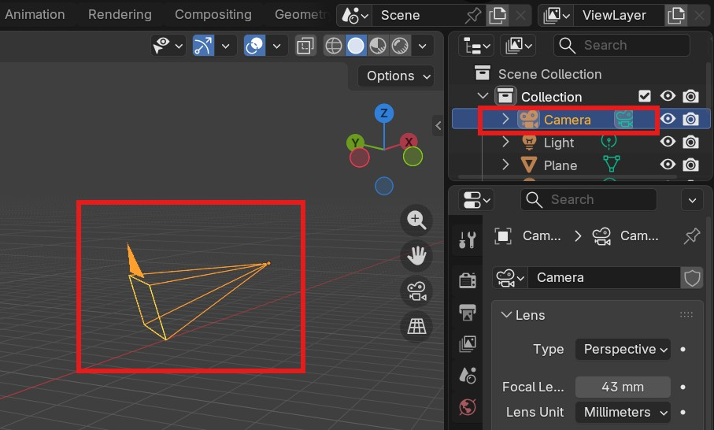

-  look through the camera using the camera button.

The red rectangle shows you are currenly looking through the camera

 - Lock the camera so that it follows you around the scene.

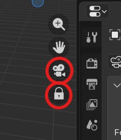

(unlock it again when you want to edit your scene)

With the camera selected, you can see its properties if you choose the camera icon at the bottom of the properties frame.

The camera mimics a real video camera, so you can change the focal length, depth of field, f-stop and lots of other properties to get the result you want.

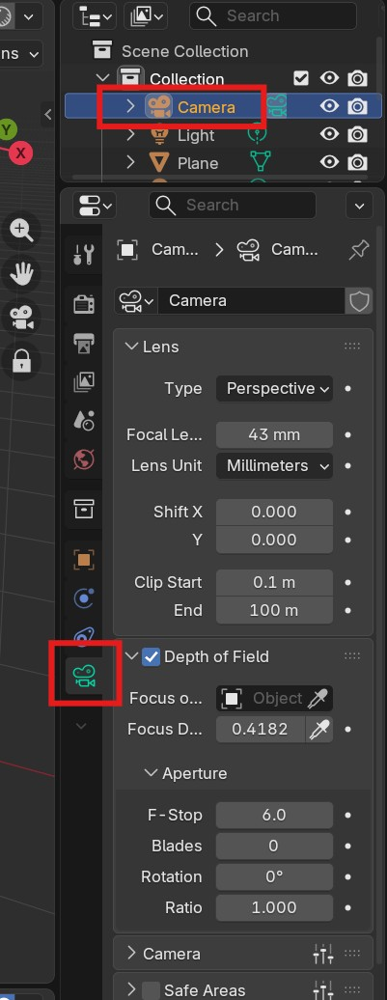

Make sure your viewport shading is set to **render**

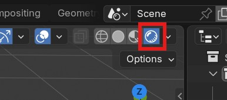

Experiment with the **Depth of Field** propery.

- Turn it on
- Change the f-stop to somthing small (1.8)
- use the eye dropper next to the focal distance to select the pumpkin.

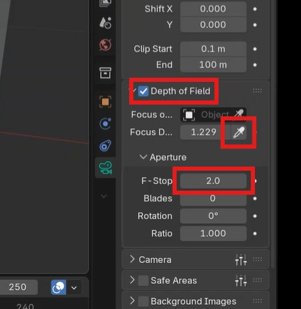

If you get stuck, watch this video:
[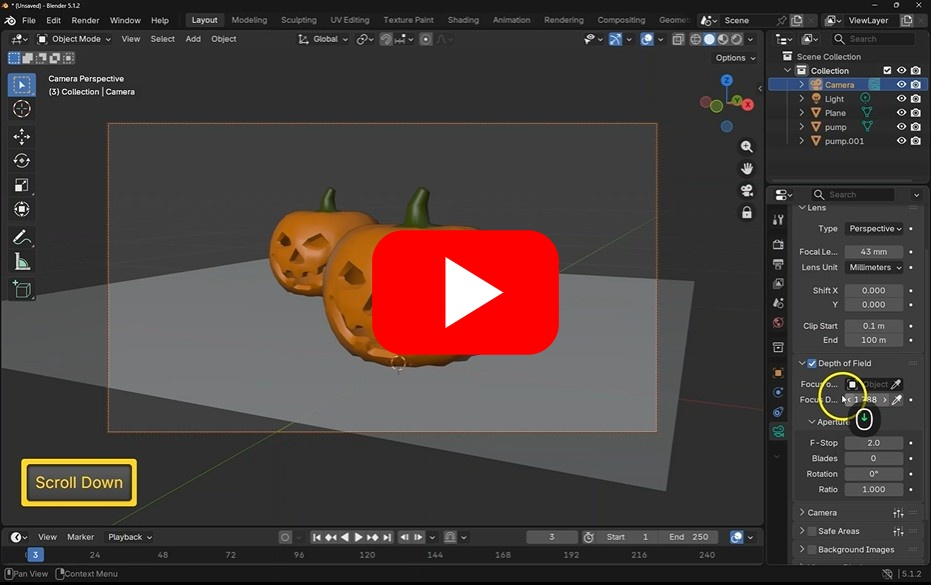](https://uwe.cloud.panopto.eu/Panopto/Pages/Viewer.aspx?id=2e203323-a7ac-47a9-8ae9-b494009a6287)

## Lighting

Without lighting our scene would be dark

In a default scene Blender gives us one point light

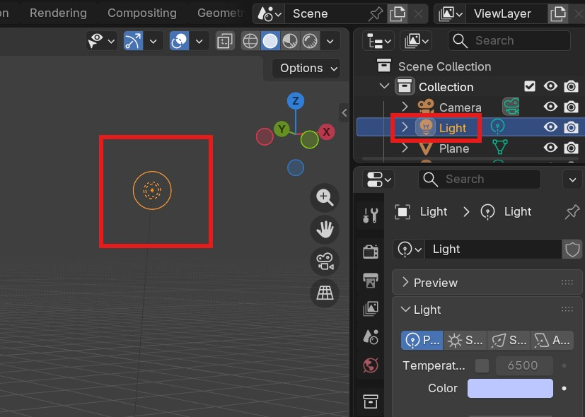

Move the light around using **G** to light the front of your Pumpkins.

With a light selected, you can change the properties in the light section of the properties frame.

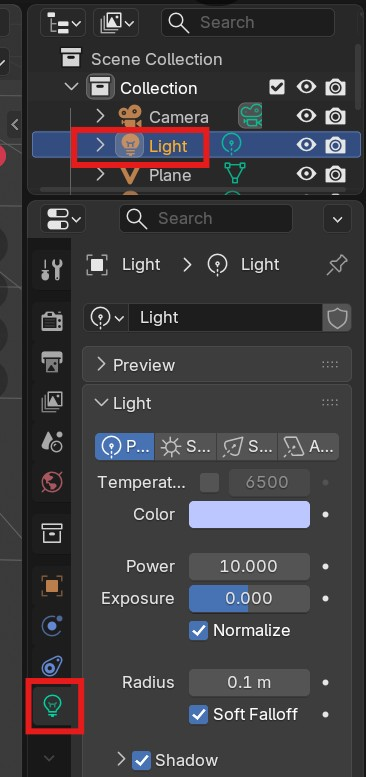

Some of the properties such as **colour** and **power** are common to all lights.

- Change the power to 10 and the colour to  light blue.

### Other lights

You can create new lights by going to **Add > Light**

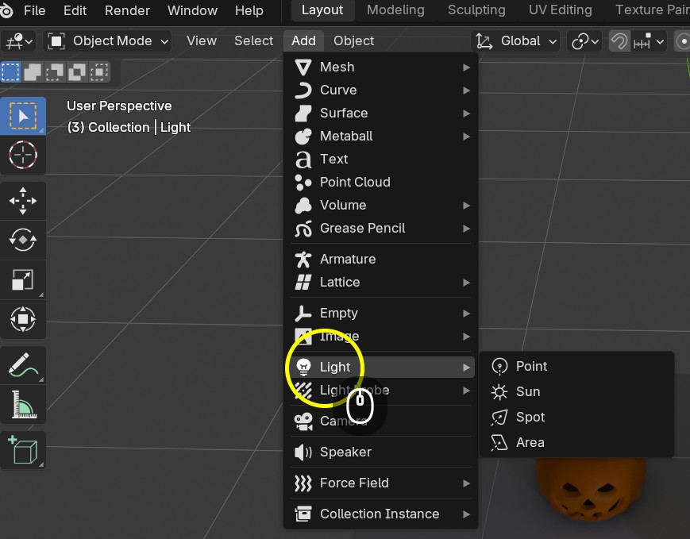

You can choose from four different types

- Point
	- like a light bulb
	- Shines light in all directions
- Sun
	+ Parallel rays in one direction
	+ Useful for outdoor scenes
	+ Position does not matter, only rotation
- Spot
	+ Like a theatre spotlight
	+ Produces a cone of light in one direction
	+ Angle and blend can be adjusted
- Area
	+ A rectangular panel of light
	+ Only shines from one side
	+ Can be scales
	+ Great for windows or openings
	
- Experiment with all these lights in your scene.

They can even be put inside objects, for instance, inside the pumpkin.

This video shows you how to add and edit lights if you get stuck:

[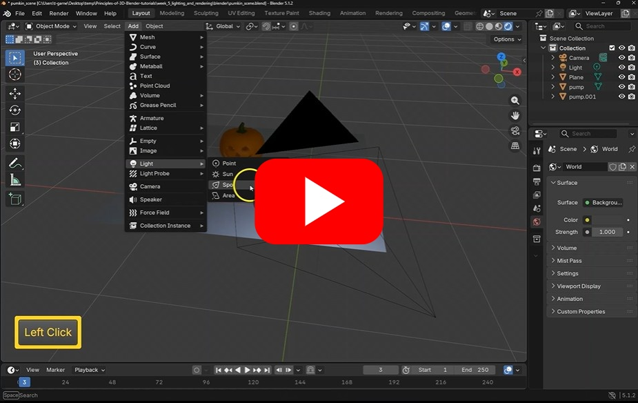](https://uwe.cloud.panopto.eu/Panopto/Pages/Viewer.aspx?id=be42ad13-12b0-4b33-a03b-b494009d77c0)

### Emissions

Objects can give off light by giving changing their materials emission property.

- Create new a new uv Sphere and scale and position it behind the eye

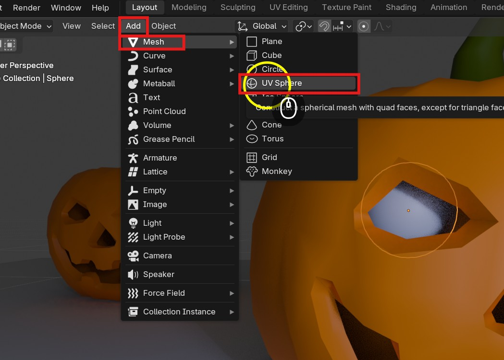

- Create a new material

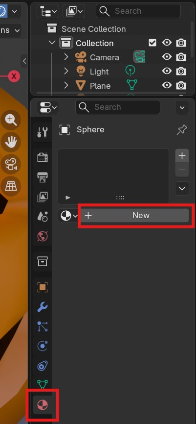

Change the Emission **colour** and **strength**

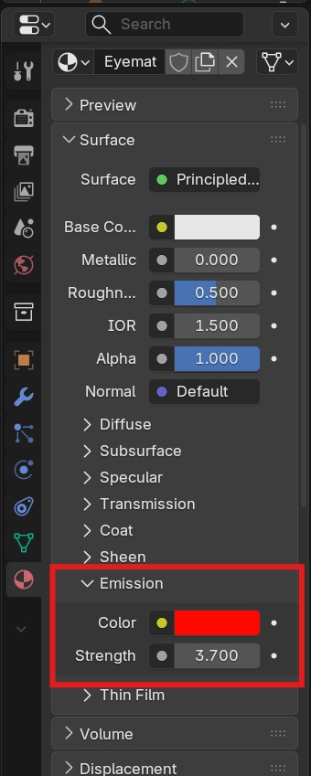

Your eye should now glow.

This video shows you how to add emission to materials:

## Output settings and Render

Now that we have setup our scene we can render it out to a jpg or png image

### Output properties

You can check the output resolution of your scene in the output properties

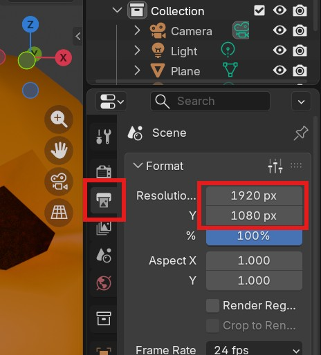

We want to check resolution is **1920** by **1080** pixels (px).

### Render properties

We can now choose our renderer, you can access the render properties just above the output properties.

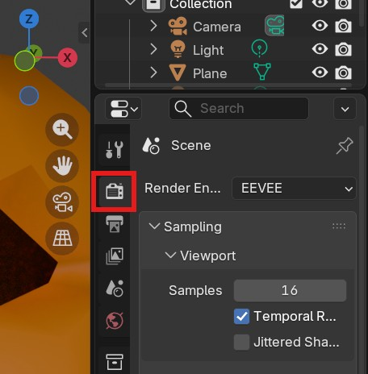

Blender has 2 main renders, **EEVEE** and **Cycles**

You can change between them from the dropdown

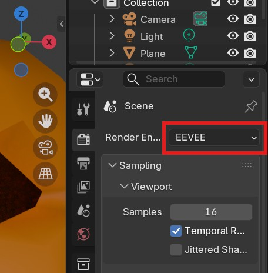

You can use either one for this project but they are different.

**Eevee** is very fast but it lacks some of the advanced features which allow **Cycles** to produce photo realistic renders.

If you have a slower machine it may take a long time to render out a single cycles image.

They both have many properties you can change for Viewport Rendering and final Rendering.r

The viewport will use the selected renderer when in **Rendered** mode.

### Eevee

You can experiment with all the properties, but a quick win to improve your image turn on **Raytracing**

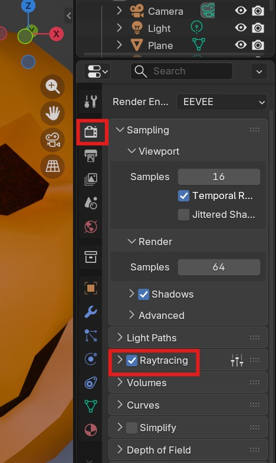

### Cycles

By default, cycles can be slow to render, there is always a trade off between speed and render quality, but for a simple scene there are some things you can change

- Reduce the **max samples**
- Add **Denoise**
- Reduce **Light Paths** max bounces

## Final Render

To finally render out an image go to 

**Render > Render Image**

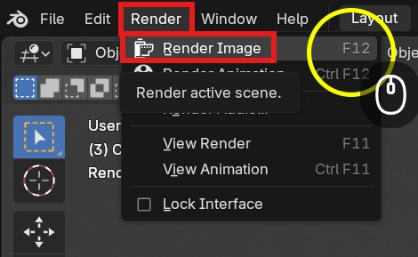

This will render out your image and save open it in a new window

To save the image, choose **Image > Save As...**

You can now close this window, move the camera and adjust the scene and render out another image.

Here is a video showing you how to render out your images

[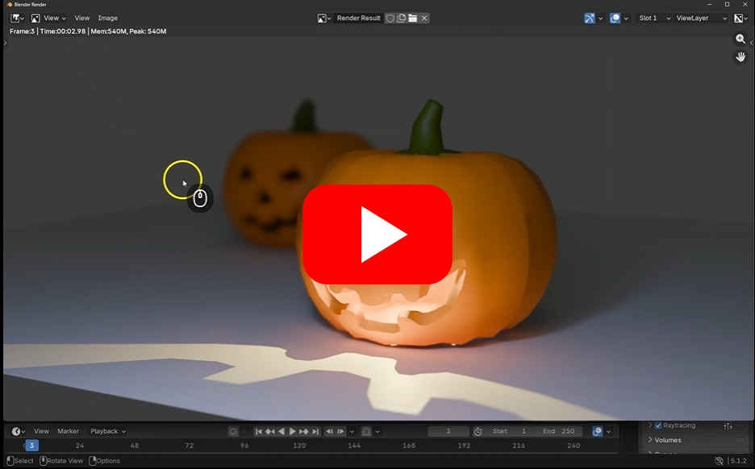](https://uwe.cloud.panopto.eu/Panopto/Pages/Viewer.aspx?id=82b97ec1-79ee-44af-ae85-b49400a6be4e)

## Challenge

Import a different model, light it and render it.

Think about the composition, how can I emphasise the scale and mood in my render.

