# Output from Blender to Unity

There are a few steps you need to do to make sure your object comes through to Unity as expected

## Prepare your object for export

### 1. Centring and Grounding

Your object should be in the center of the scene, If not, it may be hard to find and manipulate in Unity.

The base should also be on the ground

- Move your object so that its centered and on the ground.

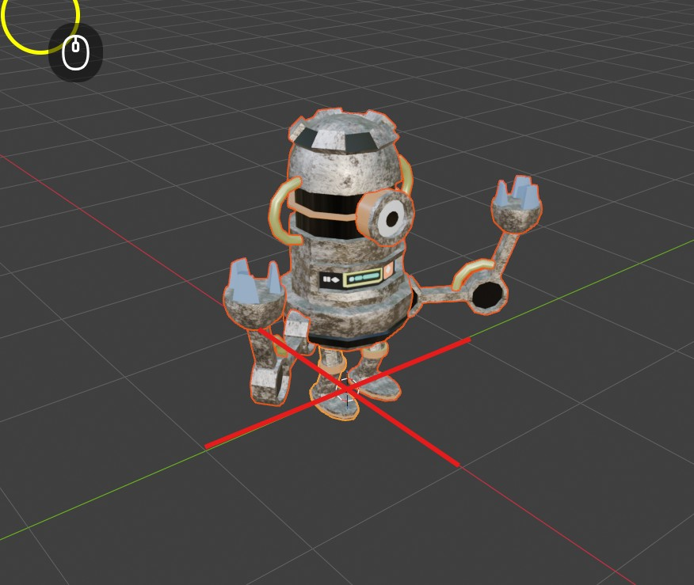

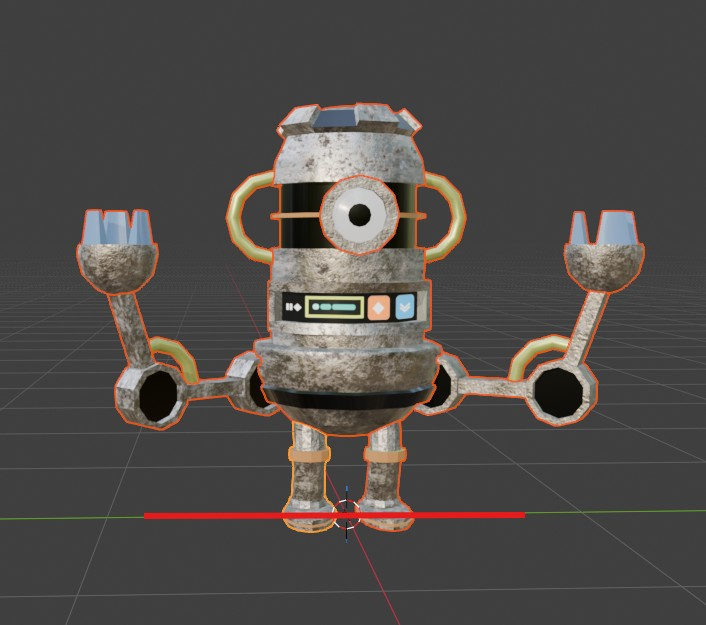

### 2. Size

Although you can scale up objects in Unity, it is best practice to make them the correct size in Blender first to avoid creating extra work and confusion

This is particularly important if you object needs to be a specific size

With your object selected, open the **items menu** (shortcut n) and look at the **dimensions**

- Scale the object up until it is the correct size

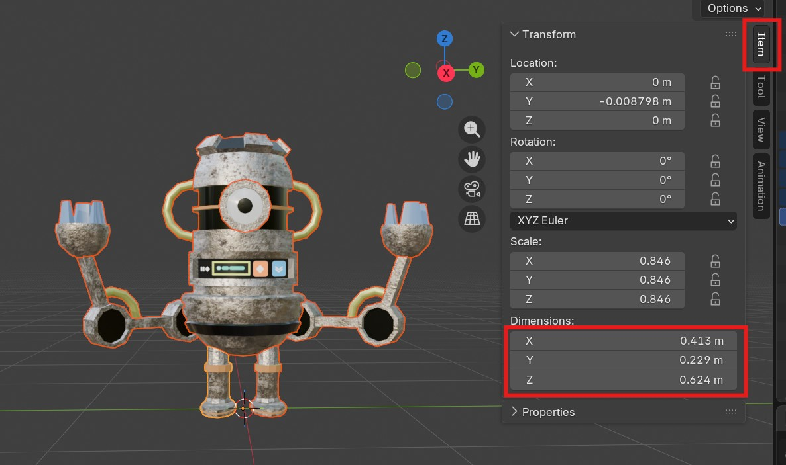

### 3. Scale

Now that we have scaled up the object you can see its scale is no longer 1.

We need to reset this to stop it returning to the original scale in Unity 

- Select the object, choose **Object > Apply > All Transforms** (shortcut Alt + A)

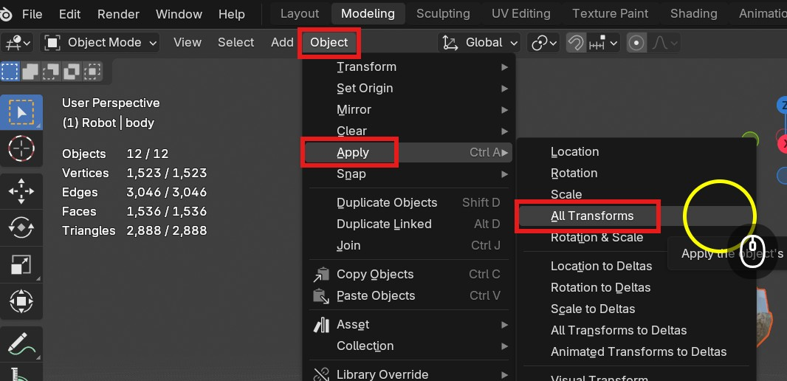

You should see the scale now reset to 1.

Here is a video showing you how to prepare your object.

[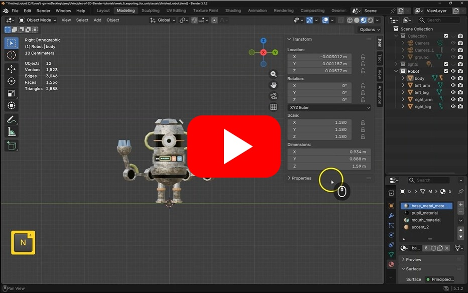](https://uwe.cloud.panopto.eu/Panopto/Pages/Viewer.aspx?id=c710c1d1-6120-4d8e-b834-b49400fc1098)

## Export as fbx

No we have prepared our model we can export it.

You can export to different formats, but fbx is currently the best way to export for Blender.

- Select your model
- Choose **File > Export > FBX

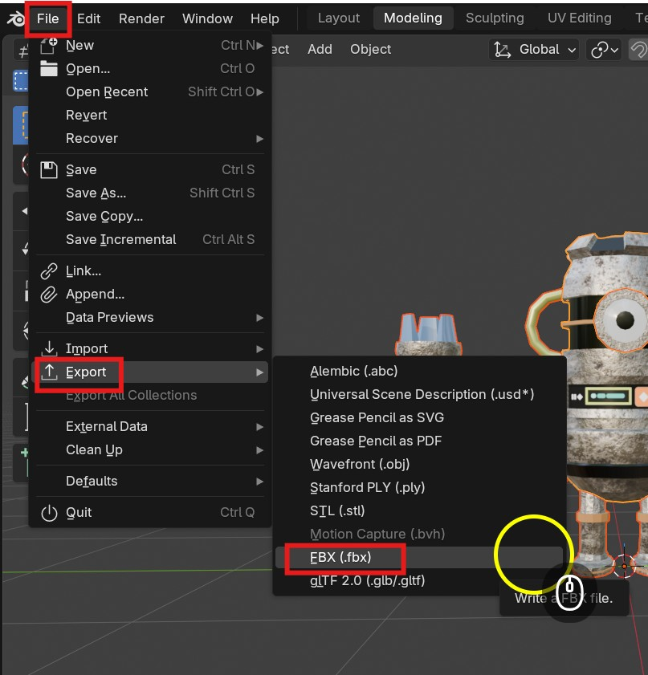

- Change **Path Mode** to **copy**

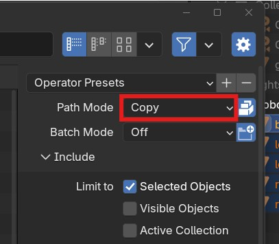

- Select **Embed textures**

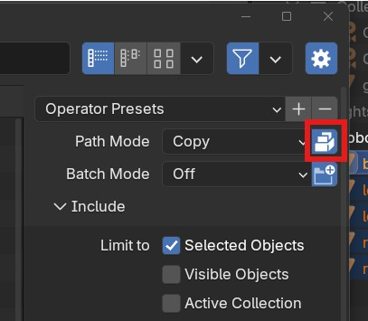

- Enable **Selected Objects**

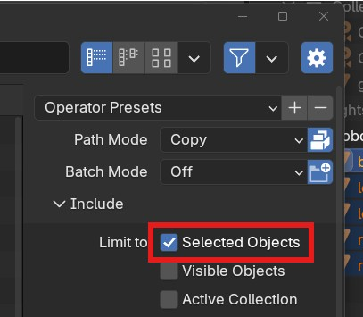

You can now save the file to somewhere convinient, or better still, inside the **Assets** folder in your Unity project.

Here is video showing you how to export from Blender as an FBX file

[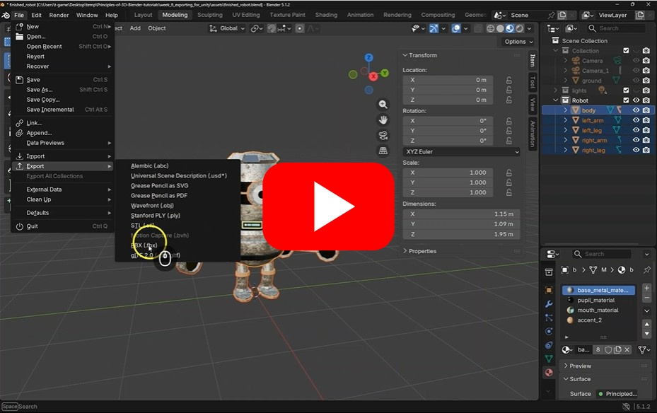](https://uwe.cloud.panopto.eu/Panopto/Pages/Viewer.aspx?id=27ebcb87-02bf-4c03-9b02-b49400fce02b)

## Import to Unity

You can now import your object into Unity

- If it is not there already, drag your fbx file into the Assets panel in your project.

I have added mine to its own folder to keep things neat.

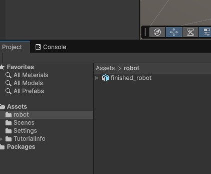

You can now drag your robot into your Unity scene or the23- Hierarcy, but it may be missing its textures.

## Fix textures

With the robot select in the Assets panel, choose the **Materials** tab in the **Inspector**

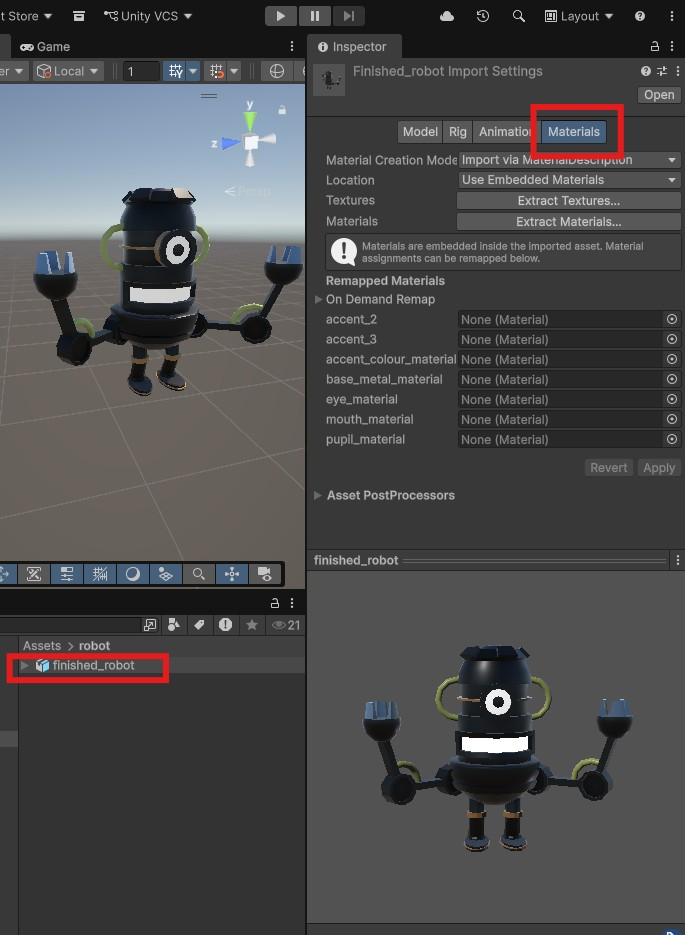

- Choose **Extract textures** and **Extract materials**, It should automatically choose the correct location in the Assets folder for you.

Your texture should now appear on your object.

## Final fixes

Because the rendere in Blender is not the same and the renderer in Unity materials do not always import correctly, you may need to some tidying.

You may need to use your experience with materials in Unity to reapply textures.

For instance, my Object is missing the **Metallic Map** image textures, I need to fix the **Normal Map** and the tiling has not pulled through.

I can fix these by dragging the metalic image into the metalic map box, choosing fix Now and changing the tiling number.

You may have other issues so check over your imported model carefully.

Here is a video showing you to import your fbx file into Unity

[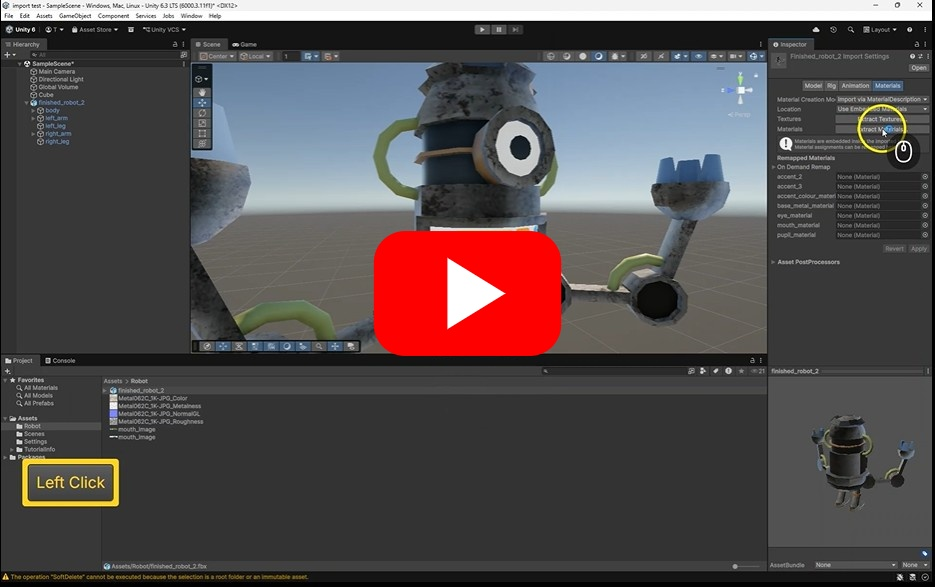](https://uwe.cloud.panopto.eu/Panopto/Pages/Viewer.aspx?id=7866da9b-74a3-402a-8fb7-b49400fdff5d)

## Challenge 1

Try to import a model you have made in Blender into your Unity scene.

## Challenge 2

You can find free assets on Sketchfab.com. Download the Fbx version of this Dog model and try to import it into your scene ( or find another model from the internet someone else has made)

[K9 Skechfab model](https://sketchfab.com/3d-models/k9-doctors-who-dog-746aff4a91c246329e64dbd2f0f65313)

