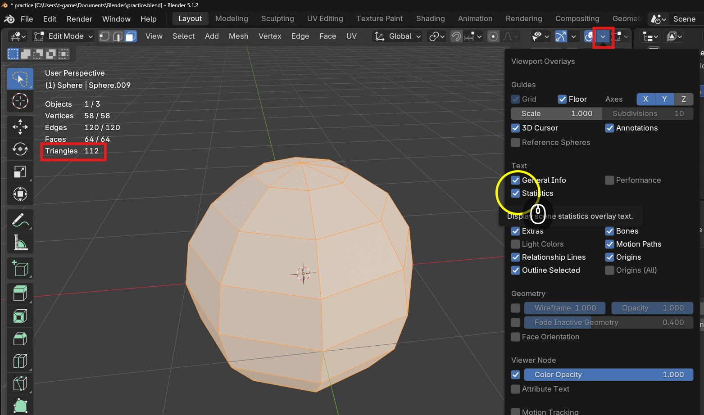
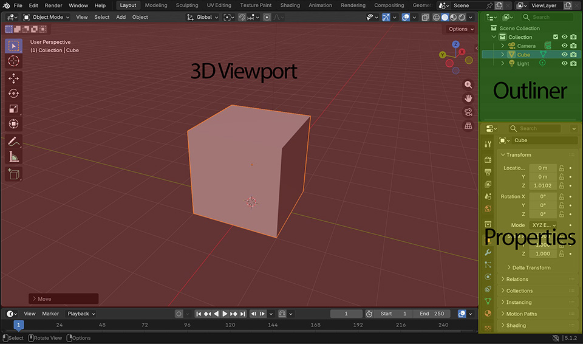
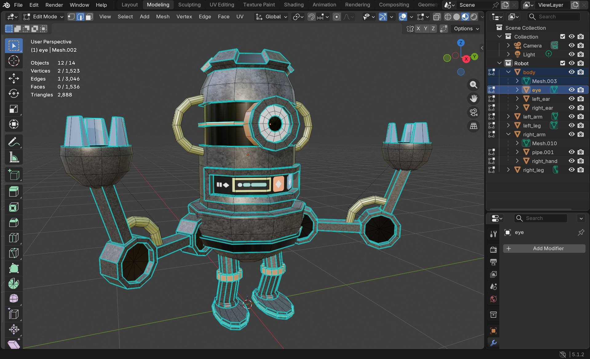

# Preparing for submission

For the principles of 3D module you do not need to submit your entire Blender file, just 3 renders and a screen shot.

You can see how to create your renders in the week 5 worksheet, these should be rendered out from Blender, not screen shots.

For the screen shot, we want to be able to see how you have contructed your model, therefore want to see a few things:

- The triangle count
	+ You can show this by turning on stats in the overlay menu
	+ 
	+ If you select your object you will see the triangle count
- The outliner to see if you have named and organised your objects logically
	+ 
- The textured mesh so that we can see how you have constructed your model

You can create a screenshot on a pc by using the snipping tool installed with Windows 
- [How to use the snipping tool](https://support.microsoft.com/en-us/windows/apps/use-snipping-tool-to-capture-screenshots)

On a mac you can take a screen shot using **shift + cmd + 4** 
- [Screen shot shortcuts](https://support.apple.com/en-gb/102646)

Your screenshot should look something like this

 
 Good luck with your submission.